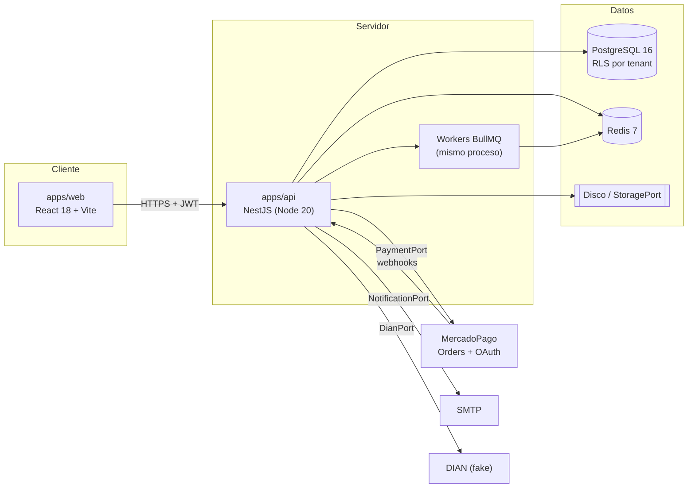
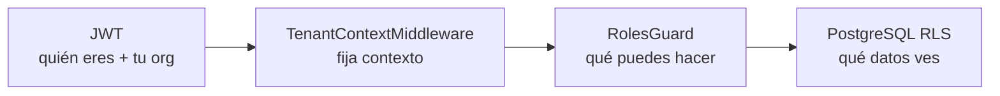
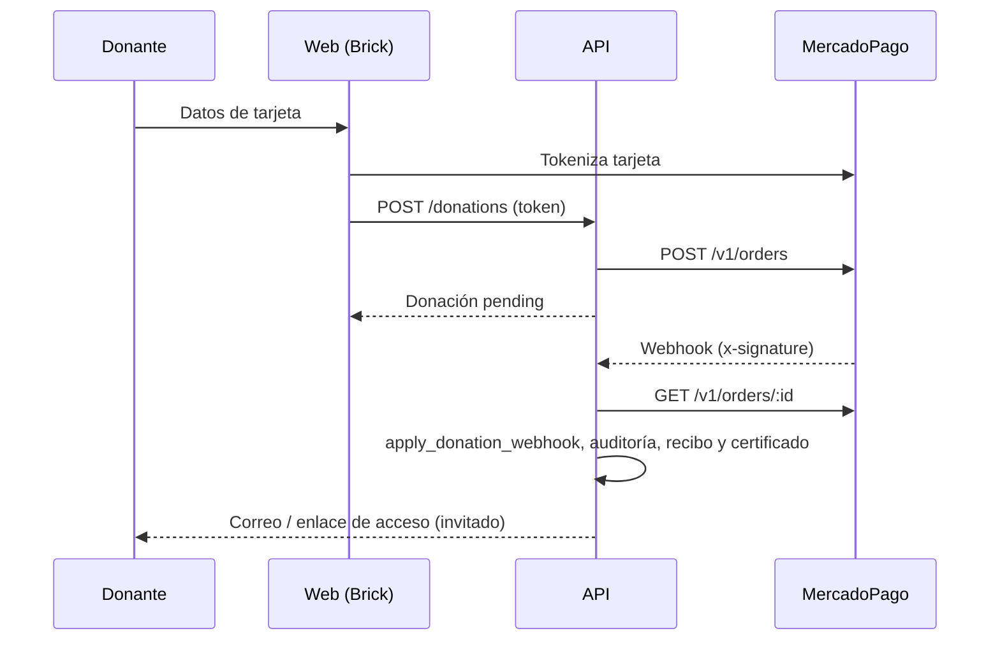

# Arquitectura de AdoptaFácil V2.0

> Documento generado a partir del código del repositorio (commit `d433de5`). Complementa el
> [diccionario de datos](diccionario-datos/diccionario-datos.html), el [MER](diccionario-datos/mer.html)
> y [CONTRACTS.md](CONTRACTS.md).

## 1. Visión general

Plataforma web **multi-tenant** para el ecosistema de rescate animal en Colombia: muchas organizaciones y
personas conviven en un mismo sistema (adopciones, donaciones, campañas, apadrinamientos, voluntariado,
banco de recursos, marketplace, comunidad y reputación). Su sello es la **transparencia y la confianza**.
Es gratis para las organizaciones; el ingreso es una comisión del 4 % sobre las transacciones, con
desglose transparente (IVA solo sobre la comisión).

## 2. Estructura del monorepo

| Ruta                 | Contenido                                                                                    |
| -------------------- | -------------------------------------------------------------------------------------------- |
| `apps/api`           | Backend NestJS (`@adoptafacil/api`)                                                          |
| `apps/web`           | Frontend React 18 + Vite 5 + react-router 6 (`@adoptafacil/web`)                             |
| `packages/contracts` | DTOs, enums, puertos y lógica compartida (comisiones, adaptadores fake)                      |
| `packages/ui`        | Librería de componentes (Radix + CVA + SCSS modules, Tailwind preset)                        |
| `prisma/`            | Esquema dividido por módulo (`schema/*.prisma`), ~67 migraciones, `rls-policy.reference.sql` |
| `scripts/`           | `setup-env.mjs`, `render-setup-roles.sh`, `generate-docx-manuals.mjs`                        |
| `docs/`              | Documentación (contratos, guía de demo, manuales, diccionario de datos y MER)                |

- **Gestor y build:** pnpm 9.15.9 (workspaces) + Turborepo (`build`, `lint`, `typecheck`, `test`, `dev`). Node ≥ 20.
- **Calidad:** Husky (`lint-staged` en pre-commit, `commitlint` con Conventional Commits en commit-msg).
- **Infra local:** `docker-compose.yml` con `postgres:16` (puerto del proyecto 5433) y `redis:7`.
- **`packages/contracts` se compila dual** (ESM + CJS): la API consume `dist/cjs` con `require` y el web consume
  `dist/esm`. El script `scripts/write-dist-pkg.mjs` escribe el `package.json` de cada salida. Los contratos
  cambian **solo de forma aditiva**.
- **Prisma "multi-esquema"** significa `prismaSchemaFolder` (un `.prisma` por módulo); todo vive en el schema
  `public` de Postgres.

## 3. Backend (`apps/api`)

### 3.1 Arranque y configuración

- `main.ts`: CORS (`API_CORS_ORIGIN`, `credentials: true`), puerto `PORT`/`API_PORT`, escucha en `0.0.0.0`.
- `app.module.ts` importa `ConfigModule` (validación Zod en `env.validation.ts`, falla rápido al arrancar), los
  módulos _core_ y los 14 módulos de negocio.
- Validación de entrada con `ZodValidationPipe` por controller (esquemas `*.schemas.ts` por módulo). No hay
  filtro global de excepciones: los conflictos `P2002` se traducen a `ConflictException` a mano.
- `GET /health` devuelve `{status, db, redis}`.

### 3.2 Núcleo (`src/core`)

| Pieza     | Responsabilidad                                                                                                                                           |
| --------- | --------------------------------------------------------------------------------------------------------------------------------------------------------- |
| `tenant/` | `TenantContextMiddleware`: toma `org` del JWT (o `x-org-id` válido) y ejecuta la request en un `AsyncLocalStorage`                                        |
| `prisma/` | `PrismaService` conecta como **`adoptafacil_app`**; `withTenant` / `withOrgContext` abren una transacción con `set_config('app.current_org_id', …, true)` |
| `auth/`   | Registro (organización / persona), login, refresh con rotación, reset de contraseña, Google Sign-In, perfil, rate limiting                                |
| `rbac/`   | `@Roles(...)` + `RolesGuard` deny-by-default evaluado junto con el tenant                                                                                 |
| `audit/`  | `AuditService` append-only, redacta claves sensibles (`[REDACTED]`)                                                                                       |
| `crypto/` | AES-256-GCM para firmas manuscritas                                                                                                                       |
| Puertos   | `StoragePort`, `NotificationPort`, `PaymentPort`, `IdentityPort` (+ `SignaturePort`, `DianPort` locales)                                                  |

### 3.3 Autenticación

- **Access token** JWT `{sub, org, typ, email}` (15 min por defecto). **Refresh token** opaco de 48 bytes; en
  BD solo se guarda su hash SHA-256, se rota en cada uso y un nuevo login revoca las demás sesiones.
- Cookie `af_refresh` httpOnly (en producción `secure` + `sameSite=none`).
- `register/organization` crea Organization + User + credencial, asigna `Owner` y precarga el catálogo de razas;
  `register/person` crea una organización personal sin rol.
- Contraseñas con bcryptjs; reset por correo con token de un solo uso y hasheado.

### 3.4 Puertos e integraciones

| Puerto                         | Drivers                                          | Notas                                                                                |
| ------------------------------ | ------------------------------------------------ | ------------------------------------------------------------------------------------ |
| `STORAGE_PORT`                 | `disk` (por defecto), `stub` (en memoria, tests) | Claves `<public\|private>/<orgId>/<uuid>-<nombre>`, protección contra path traversal |
| `NOTIFICATION_PORT`            | `log` (por defecto), `smtp` (nodemailer)         |                                                                                      |
| `PAYMENT_PORT`                 | `fake` (por defecto), `mercadopago`              | Ver sección 6                                                                        |
| `IDENTITY_PORT`                | `fake`, `google`                                 |                                                                                      |
| `DIAN_PORT` / `SIGNATURE_PORT` | adaptadores fake                                 | Verificación DIAN y firma de contratos simuladas                                     |

### 3.5 Módulos de negocio (`src/modules`)

| Módulo               | Responsabilidad                                                                                                                                           |
| -------------------- | --------------------------------------------------------------------------------------------------------------------------------------------------------- |
| `org` (M01)          | Perfil y portal público, formalización (máquina de estados), documentos, representante legal, verificación DIAN (cola), duplicados, ajustes de plataforma |
| `portals` (M14)      | Tokens de tema y resolución de subdominio                                                                                                                 |
| `animals` (M03)      | Expediente, carnet clínico (PDF/JSON), recordatorios, divulgación de comportamiento, importación masiva (Excel), catálogo público                         |
| `adoptions` (M04)    | Solicitud y kanban, contrato con firmas (PDF + hash inmutable), seguimiento post-adopción                                                                 |
| `donations` (M05)    | Donación con desglose, recibo, certificado (ESAL con RTE), checkout de invitado                                                                           |
| `campaigns` (M06)    | Campañas, evidencias inmutables y financiamiento desde donaciones                                                                                         |
| `sponsorships` (M07) | Planes, suscripción, historial inmutable, facturación recurrente                                                                                          |
| `volunteering` (M08) | Oportunidades, inscripción, horas de servicio, certificados PDF                                                                                           |
| `resources` (M09)    | Necesidades, ofertas, entregas, evidencias y pruebas                                                                                                      |
| `marketplace` (M10)  | Catálogo por organización con contacto por WhatsApp (sin carrito)                                                                                         |
| `community` (M11)    | Feed, comentarios, likes y moderación                                                                                                                     |
| `reputation` (M12)   | Reseñas con moderación y resumen público                                                                                                                  |
| `dashboards` (M13)   | Tableros de plataforma y de organización                                                                                                                  |
| `payments`           | Cuenta bancaria, payouts, conciliación, OAuth de MercadoPago                                                                                              |

Convención de rutas: `/<recurso>` para usuarios autenticados, `/public/...` sin autenticación y `/platform/...`
solo para `PlatformAdmin` / `PlatformSuperAdmin`.

### 3.6 Colas y workers (BullMQ sobre Redis)

| Cola                        | Función                                   | Frecuencia               |
| --------------------------- | ----------------------------------------- | ------------------------ |
| `clinical-reminders`        | Escaneo y envío de recordatorios clínicos | Diaria                   |
| `adoption-followups`        | Marca hitos vencidos                      | Configurable             |
| `dian-verification`         | Verificación DIAN con backoff             | Por evento               |
| `sponsorship-billing`       | Escaneo de cobros y _poller_ de pagos     | Diaria / 300 s           |
| `mercadopago-token-refresh` | Renueva tokens OAuth antes de vencer      | Diaria                   |
| `wompi-payouts`             | Despacho de payouts (nombre heredado)     | Por evento, 5 reintentos |

## 4. Seguridad (cadena de confianza)

1. **Multi-tenant + RLS.** Toda tabla de negocio lleva `organization_id` con `ENABLE` + `FORCE` + policy
   `tenant_isolation` (`organization_id = NULLIF(current_setting('app.current_org_id', true),'')::uuid`). El
   runtime conecta como `adoptafacil_app` (`NOSUPERUSER NOBYPASSRLS`). Referencia en `prisma/rls-policy.reference.sql`.
2. **RBAC deny-by-default.** Roles: `Owner`, `Administrator`, `Operator`, `Volunteer`, `TemporaryCollaborator`,
   `Veterinarian`, `ReadOnlyAuditor` (organización) y `PlatformAdmin`, `PlatformSuperAdmin` (plataforma).
3. **Funciones `SECURITY DEFINER`** (`search_path = public`) para exposición pública o escritura cross-tenant
   controlada (p. ej. `create_adoption_request`, `create_donation`, `public_campaigns`), que exponen solo las
   columnas necesarias.
4. **Auditoría append-only.** `audit_logs` solo permite `SELECT`/`INSERT` al rol de la app y tiene triggers que
   abortan `UPDATE`/`DELETE`/`TRUNCATE` incluso para superusuario.
5. **Inmutabilidad por trigger:** historial de formalización, eventos clínicos, historial de apadrinamientos,
   evidencias de campañas, certificados de voluntariado, divulgaciones de comportamiento, contratos firmados,
   documentos y duplicados decididos, reseñas y pagos de apadrinamiento (contenido).
6. **Otros controles:** gate de perfil completo para donar / apadrinar / adoptar / ser voluntario, webhooks con
   HMAC en tiempo constante, firmas cifradas con AES-GCM, tiempos en UTC (la hora Colombia solo en la UI).
7. **Gate de CI `rls-no-leak`:** ~32 pruebas que siembran datos en la organización A y verifican que no son
   visibles desde la B. Toda tabla nueva de negocio debe quedar cubierta.

## 5. Base de datos

- PostgreSQL 16 con Prisma 5.22; ~60 modelos en 14 archivos de esquema (ver el
  [diccionario de datos](diccionario-datos/diccionario-datos.html) y el [MER](diccionario-datos/mer.html)).
- Cada migración añade a mano lo que Prisma no modela: RLS, grants, funciones `SECURITY DEFINER`, triggers y FKs
  cross-módulo. **Una migración por PR**, con aviso previo al otro desarrollador.
- Los estados se guardan como texto (sin enums de BD); las estructuras JSON se tipan en `packages/contracts`.

## 6. Pagos

- **Comisiones** (`packages/contracts/src/payments.ts`): plataforma 4 %, pasarela 2,65 % + COP 700 (`TODO(client)`),
  IVA 19 % solo sobre comisiones, montos en COP enteros con redondeo half-up. Invariante:
  `bruto = neto + comisión + IVA comisión + pasarela + IVA pasarela`. La comisión la puede absorber la
  organización o el donante.
- **MercadoPago:** cobro con **Checkout API / Orders** (`POST /v1/orders`) y el Card Payment Brick en el front
  (el número de tarjeta nunca llega al backend, solo un token de un solo uso).
- **Webhook:** valida `x-signature` (HMAC), consulta la orden y aplica el resultado con una función
  `SECURITY DEFINER` idempotente.
- **OAuth Connect:** cada organización conecta su propia cuenta; los tokens se guardan en
  `organization_mercadopago_accounts` (con RLS) y un job los renueva.

- **Apadrinamiento recurrente:** el primer cobro es inmediato; un cron diario abre el período y recorre una
  escalera de recordatorios (días 5/15/25) y expiraciones (10/20/30), tras lo cual suspende. No hay débito
  automático real: la vía de pago tras una suspensión es `POST /sponsorships/:id/retry-payment`.
- **Dispersión T+1 y payouts:** la dispersión real (API "Disbursements") **no está implementada**;
  `createPayout` lanza error hasta que MercadoPago apruebe los permisos. Hoy es una operación manual de un admin
  de plataforma. La conciliación (`GET /platform/reconciliation`) compara donaciones aprobadas contra payouts.

## 7. Frontend (`apps/web`)

- **Arranque:** `main.tsx` → `Shell` → `AppProviders` (sesión, transparencia, navegación, toasts) →
  `BrowserRouter` → `AppRoutes`.
- **`src/shell/`:** cliente API con refresh automático, auth (`RequireAuth`, `RequireRoles`, cierre por
  inactividad de 20 min), layout, navegación por rol (copia de los `@Roles` del backend), rutas y tema.
- **Sesión:** los tokens viven solo en memoria; la persistencia entre recargas usa la cookie httpOnly
  (`POST /auth/refresh/silent`). Si no se pueden cargar los roles, se aplica deny-by-default.
- **Rutas:** públicas (`/`, `/o/:slug`, campañas, recursos, marketplace, reseñas, donaciones de invitado,
  verificación de certificados) y protegidas por rol (`/organizacion/*`, `/plataforma/*`, adopciones, animales,
  etc.).
- **Portales y subdominios:** con `VITE_PORTAL_BASE_DOMAIN`, un host `.<dominio>` resuelve la organización y
  `/` renderiza su portal; sin esa variable queda la ruta `/o/:slug`.
- **`src/features/`:** un directorio por módulo (`api/`, `components/`, `model/`, `pages/`).
- **Variables Vite:** `VITE_API_URL`, `VITE_AUTH_MODE`, `VITE_GOOGLE_CLIENT_ID`, `VITE_MERCADOPAGO_PUBLIC_KEY`,
  `VITE_PORTAL_BASE_DOMAIN`.

## 8. Pruebas, CI y despliegue

- **Unitarias:** jest (API) y vitest (web, ui, contracts).
- **Integración y RLS:** ~90 archivos `*.integration-spec.ts` contra Postgres y Redis reales, incluidos los
  `rls-no-leak-*`.
- **CI (`.github/workflows/ci.yml`):** job `quality` (lint, typecheck, build, test) y job `rls-no-leak` (migra y
  corre toda la suite de integración con el rol `adoptafacil_app`).
- **Semillas:** `seed:admin` (cuentas de plataforma), `seed:demo` (datos de demostración idempotentes),
  `seed:breeds`.
- **Despliegue (`render.yaml`):** Postgres y Redis gestionados, API como servicio web Node (healthcheck
  `/health`, disco persistente de 1 GB) y el web como sitio estático con reescritura SPA. Escalar a más de una
  instancia de API exige un `StoragePort` real, porque el disco no se comparte.
- **Operativo:** `scripts/render-setup-roles.sh` rota la contraseña de `adoptafacil_app` y restaura `FORCE RLS`
  cuando el owner puede saltarse RLS.

## 9. Flujos clave

1. **Login y tenant:** credenciales → access + refresh token → el front carga `GET /rbac/my-roles` → cada
   request lleva el Bearer → el middleware fija el tenant → `RolesGuard` → servicios con `withTenant` → RLS.
2. **Adopción:** una persona con perfil completo crea la solicitud (escritura cross-tenant vía función
   `SECURITY DEFINER`) → kanban `new → in_review → approved | rejected` → contrato
   `draft → pending_signatures → signed` (hash SHA-256 e inmutable) → seguimiento post-adopción con hitos.
3. **Donación:** checkout (con o sin cuenta) → Orders → webhook → recibo, certificado (si aplica) y financiamiento
   de campaña.
4. **Apadrinamiento:** cobro inicial → ciclo mensual con recordatorios → suspensión automática y reintento
   manual.

## 10. Divisiones y reglas de trabajo

- Dos dominios en paralelo: **Sebastián** (core, org, animales y registros) y **Fabián** (shell, `packages/ui`,
  adopciones, portales, pagos, donaciones, recursos, marketplace, comunidad). Infra compartida
  (`turbo.json`, `package.json` raíz, workflows, build de `contracts`) con revisión cruzada.
- Una rama y un PR por tarea, merge _Squash_ con CI verde y aprobación; `main` protegido.
- Integraciones siempre detrás de puertos simulables; los requisitos de negocio no fijados se dejan
  parametrizables con `TODO(client)`.

## 11. Puntos de atención (deuda y discrepancias conocidas)

1. Comentarios y documentos antiguos aún mencionan **Checkout Pro** o **Wompi**; el código usa Orders y los
   drivers de pago válidos son solo `fake` y `mercadopago`. La cola de payouts conserva el nombre `wompi-payouts`.
2. `render.yaml` define `JWT_REFRESH_SECRET`, que ningún código lee. `JWT_SECRET` debe fijarse en producción.
3. En Render existió un workaround con `NO FORCE RLS` (hallazgo S1-01 de `DEPLOY.md`); conviene verificar que
   producción tenga `FORCE RLS` activo.
4. La contraseña inicial del rol `adoptafacil_app` está en la migración `init` y debe rotarse.
5. La dispersión real y el cobro recurrente automático (vaulting de tarjetas) siguen pendientes.
6. `auth_credentials` tiene `organization_id` pero no tiene RLS; revisar frente a la invariante del proyecto.
