# AdoptaFácil

## Manual de Usuario

_Conéctalos. Cambia sus vidas._

Plataforma de adopción, donación y transparencia para el ecosistema de rescate animal en Colombia.

Todas las capturas de este manual provienen de una sesión real de la aplicación, con datos de demostración.

## Índice

[TOC]

## 1. Introducción y roles

AdoptaFácil conecta a las organizaciones de rescate animal (refugios, fundaciones) con las personas que quieren adoptar, donar o apadrinar. La plataforma es gratuita para las organizaciones y se sostiene con un pequeño apoyo sobre las donaciones que ellas mismas reciben — nunca un cobro oculto: el desglose completo siempre es visible antes de pagar.

Este manual está pensado para dos tipos de cuenta:

- **Persona**: adopta, dona y apadrina animales de cualquier organización.
- **Organización** (Owner, Administrador u Operador): publica animales, evalúa solicitudes de adopción, recibe donaciones y personaliza su portal público.

Cada pantalla que ves aquí es una captura real de la aplicación funcionando, no un boceto: los nombres, montos y estados que aparecen vienen de una cuenta de demostración creada para este manual.

_Nota: Cada cuenta ve solo lo que le corresponde. Una Persona nunca ve el tablero de gestión de una organización, y viceversa — la sección "7. Acceso y seguridad" explica cómo funciona esto._

## 2. Primeros pasos

Al entrar a AdoptaFácil sin haber iniciado sesión, lo primero que ves ahora es una página de bienvenida: un mensaje principal ("Encuentra a tu próxima mascota") con dos botones — "Ver mascotas en adopción" para explorar el catálogo, y "Soy una organización" para quienes representan un refugio o fundación — y, más abajo, una sección que resume qué encuentras en la plataforma.

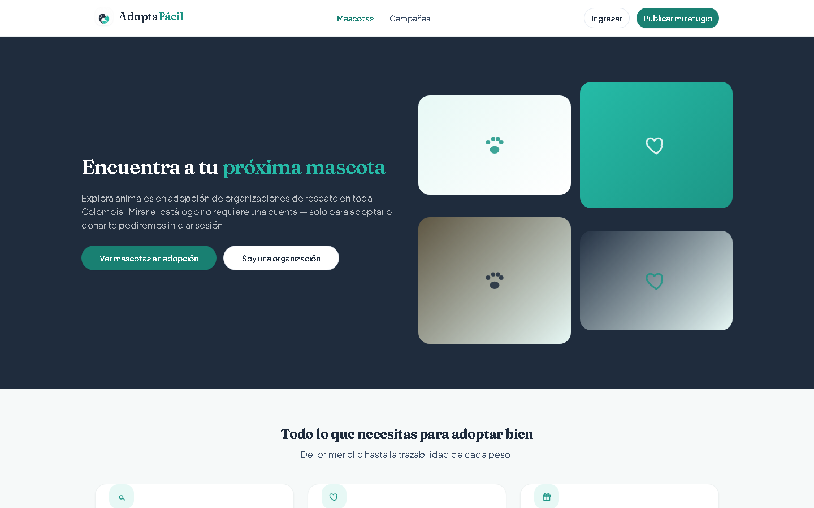
_Página de bienvenida pública — mensaje principal, botones de entrada y resumen de la plataforma._

Al pulsar "Ver mascotas en adopción" llegas al catálogo general: a la izquierda hay un panel de filtros (especie — Todas, Perro, Gato, Otros —, un buscador por nombre y un listado de ciudades con casillas y su conteo de animales), y a la derecha las tarjetas de los animales disponibles en todas las organizaciones de la plataforma.

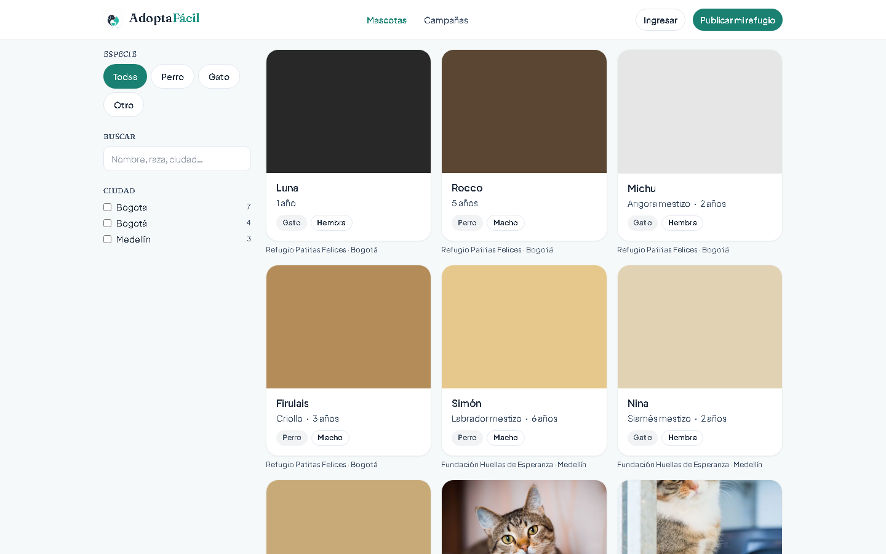
_Catálogo público — filtros de especie, búsqueda y ciudad a la izquierda; tarjetas de animales a la derecha._

El catálogo también puede verse simplemente como una cuadrícula de tarjetas, sin usar los filtros — estos son opcionales, pensados para refinar la búsqueda cuando hay muchos animales publicados:

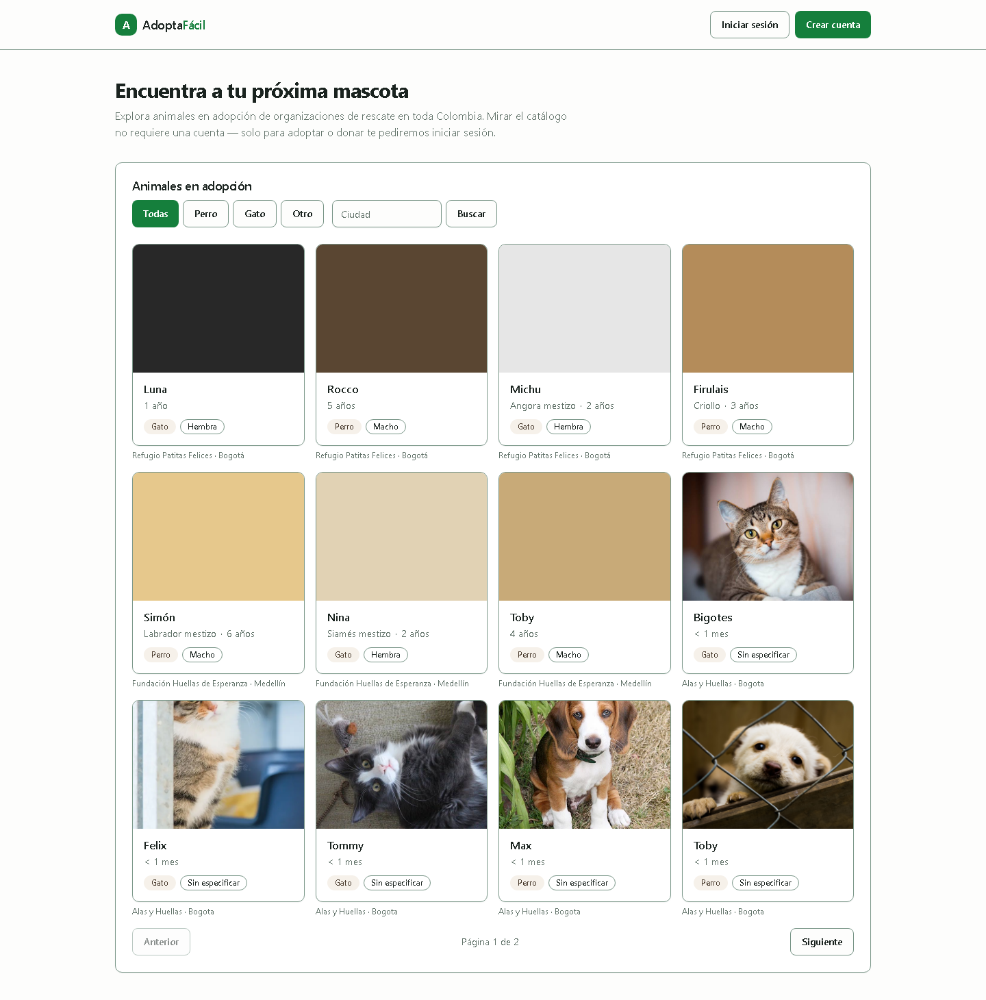
_Portafolio público — catálogo general de animales en adopción._

En otras palabras, el recorrido para un visitante nuevo tiene ahora un paso más que antes: landing → botón "Ver mascotas en adopción" → catálogo. Antes se llegaba directo al catálogo; hoy primero se ve la bienvenida.

Para adoptar, donar o apadrinar necesitas una cuenta. El registro es rápido:

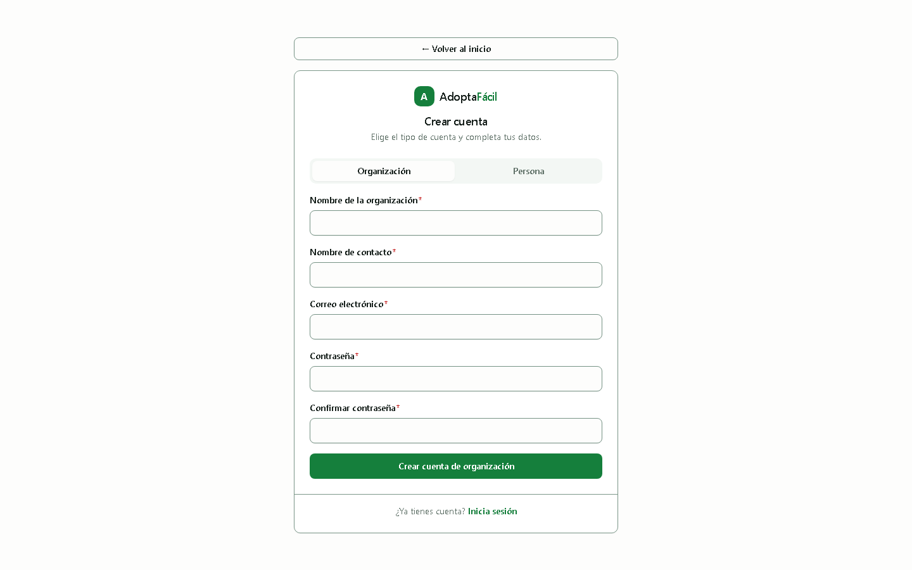
_Pantalla de registro de una cuenta nueva._

Si ya tienes cuenta, inicias sesión con tu correo y contraseña:

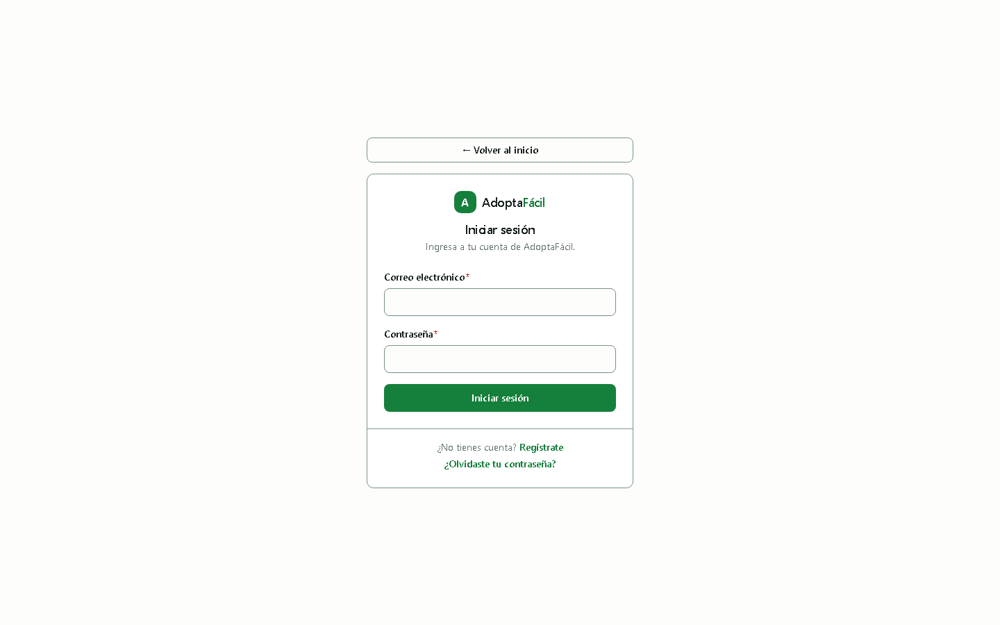
_Pantalla de inicio de sesión._

Una vez dentro, ves tu propio menú lateral — aquí, el de una Persona recién autenticada. Nota que "Adopciones" (el tablero de gestión) y "Donaciones recibidas" no aparecen: esas secciones son solo para cuentas de organización.

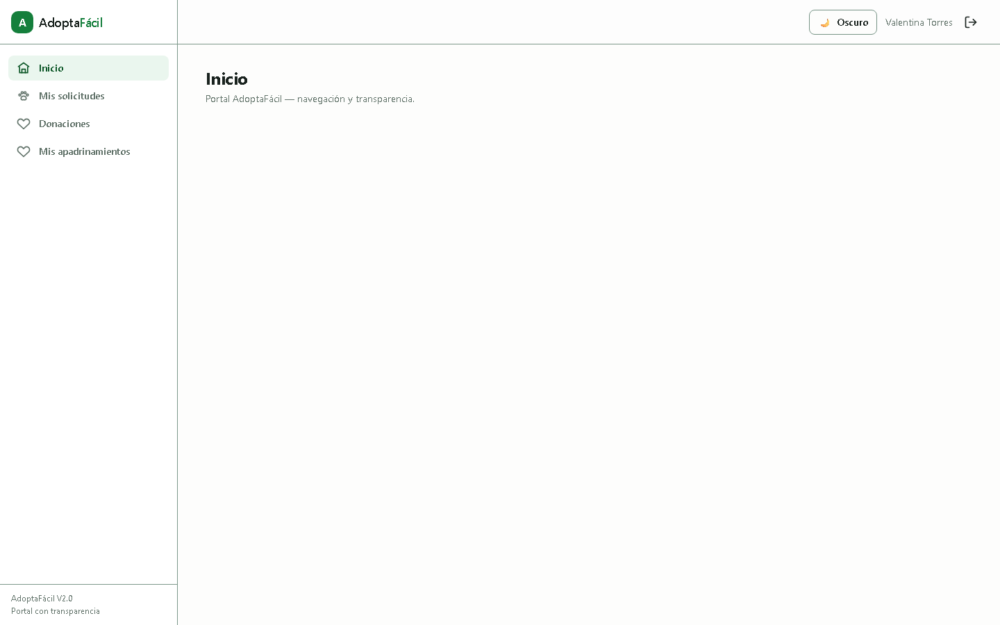
_Menú de una cuenta Persona: Inicio, Mis solicitudes, Donaciones, Mis apadrinamientos._

## 3. Explorar y adoptar

Desde el catálogo (o desde el portal público de una organización), puedes abrir el detalle de cualquier animal disponible. Ahí ves su especie, sexo, tamaño y edad — calculada automáticamente a partir de su fecha de nacimiento y expresada de forma clara (en años, en meses, o como "menos de 1 mes" para una cría recién llegada).

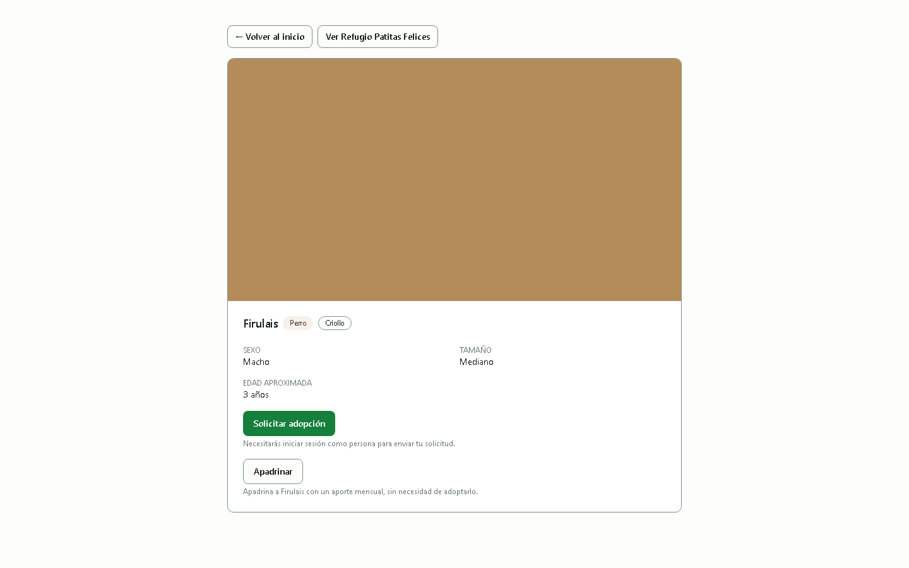
_Detalle público de un animal, con los botones "Solicitar adopción" y "Apadrinar"._

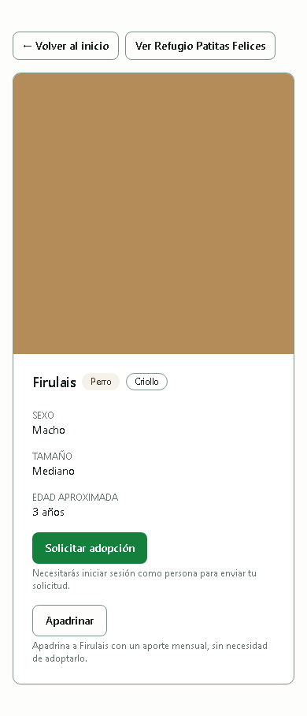
_La misma pantalla en un celular._

Dos caminos salen de aquí: "Solicitar adopción" (adoptarlo tú) y "Apadrinar" (aportar mensualmente a su cuidado sin adoptarlo). Este manual sigue primero el camino de la adopción; el de apadrinamiento se explica en la sección "5. Apadrinamientos".

Si no has iniciado sesión, "Solicitar adopción" te pide hacerlo primero. Ya autenticado, llegas al formulario:

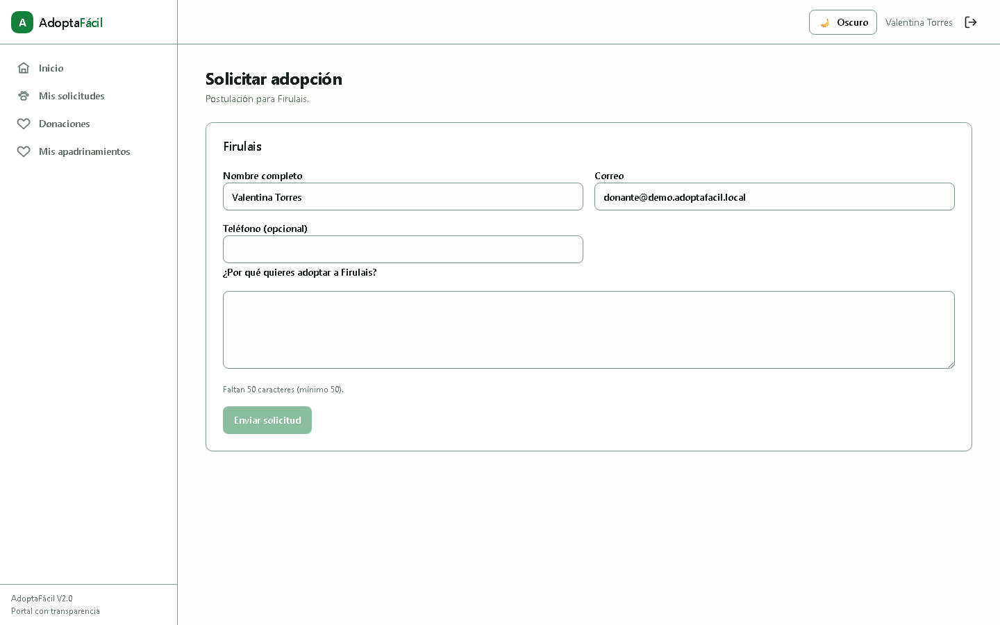
_Formulario de solicitud de adopción — datos de contacto y motivación._

El formulario pide tu nombre, correo, teléfono (opcional) y un mensaje explicando por qué quieres adoptar a ese animal en particular — con un mínimo de caracteres para asegurar una respuesta pensada, no un "quiero adoptarlo" vacío.

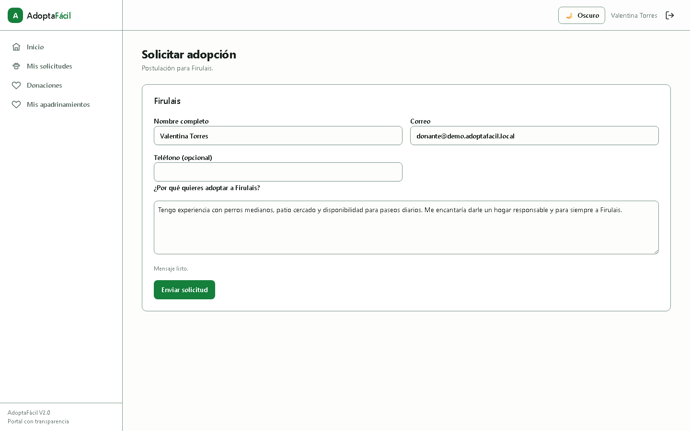
_Formulario completo, listo para enviar._

Al enviarla, la solicitud queda registrada de inmediato en estado "Nuevas":

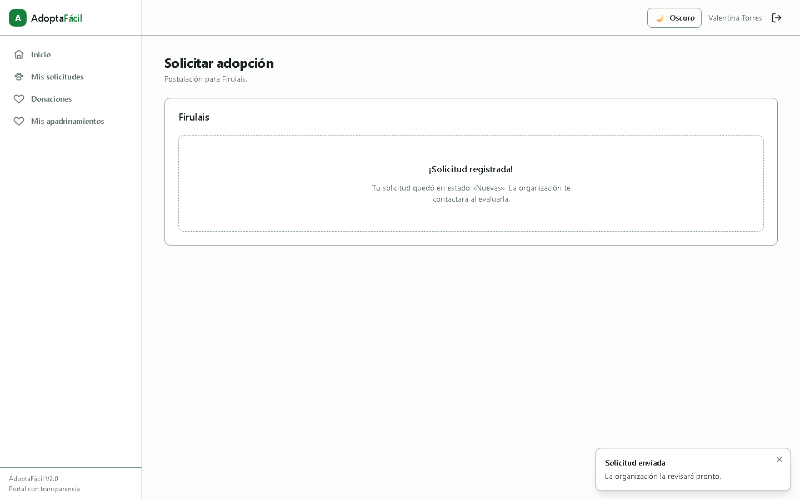
_Confirmación: la solicitud quedó registrada._

Puedes seguir el estado de todas tus solicitudes desde "Mis solicitudes" — la organización la moverá por las etapas Nuevas → En evaluación → Aprobada o Rechazada a medida que la revise.

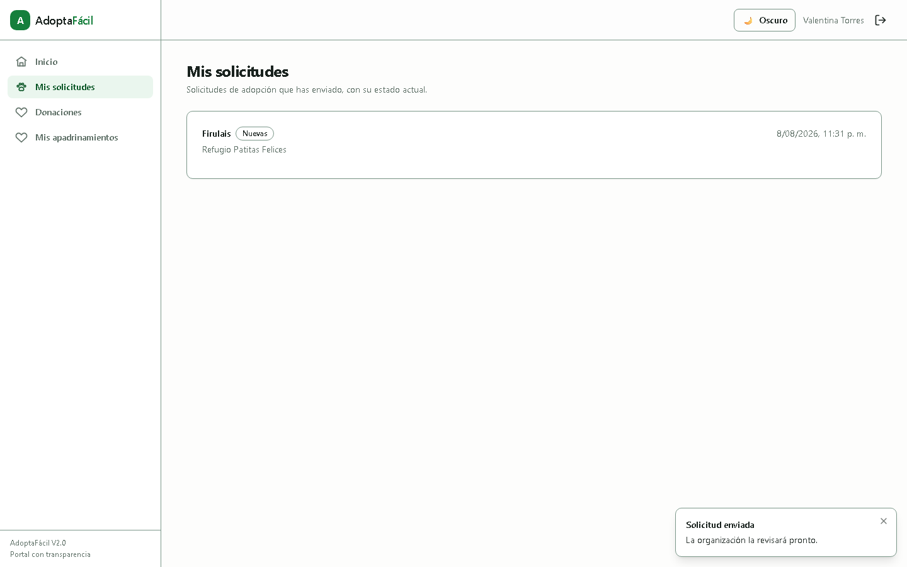
_Mis solicitudes — historial de postulaciones de la Persona._

_Nota: si en vez de entrar por el portal propio de una organización abres el detalle de un animal desde el catálogo general (la pantalla de la sección 2), este se abre como una ventana superpuesta (modal) sobre el mismo catálogo, con los mismos botones "Solicitar adopción" y "Apadrinar" además de un acceso a "Acceder a la organización" — y, si no has iniciado sesión, un aviso invitándote a hacerlo. Es una vista distinta a la de esta sección (que es la página completa del detalle dentro del portal de una organización, en `/o/:slug/animales/:id`), pero cumple la misma función; puede que llegues a un animal por cualquiera de los dos caminos._

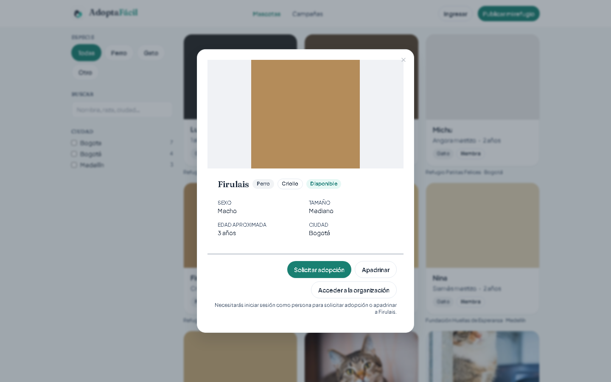
_Al hacer clic en una tarjeta del catálogo público general, el detalle del animal se abre como ventana superpuesta, no como una página nueva._

## 4. Donaciones

Cada organización tiene un portal público propio, con su información, sus animales en adopción y un botón para donarle directamente.

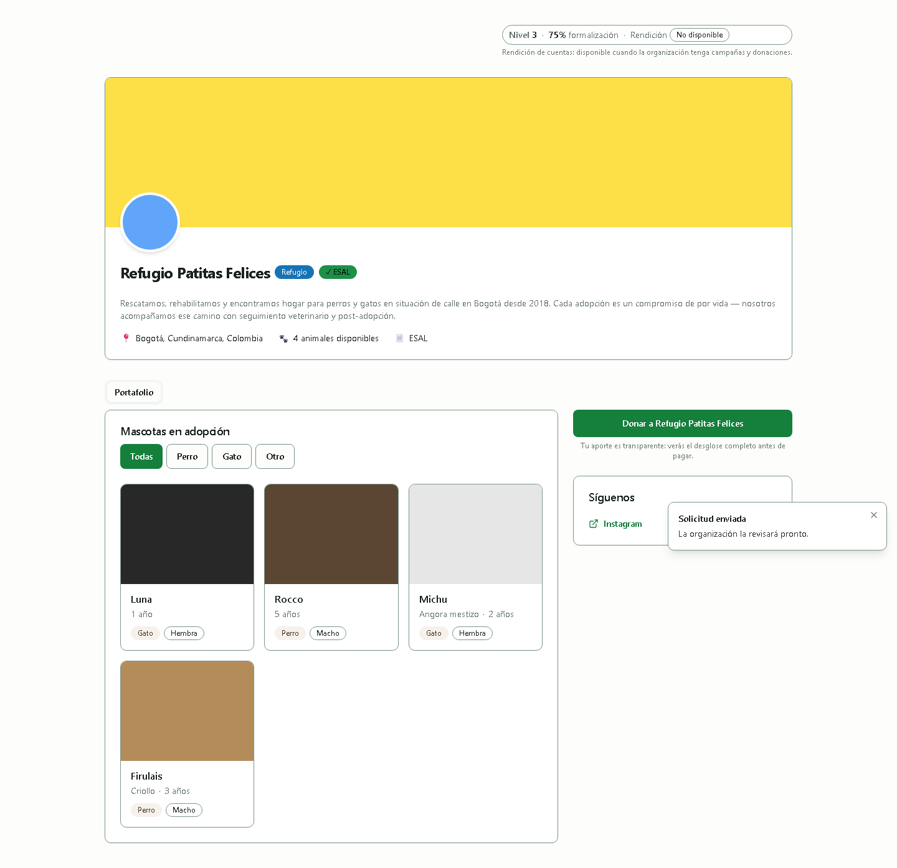
_Portal público de una organización: perfil, animales y botón "Donar"._

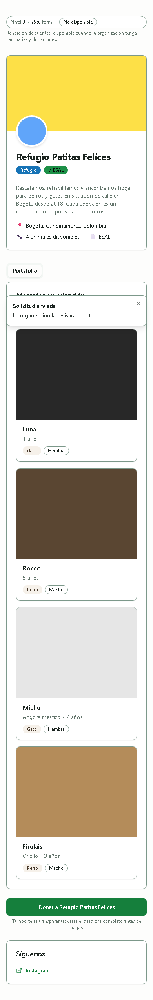
_La misma pantalla en un celular._

Al pulsar "Donar", ves el formulario de aporte:

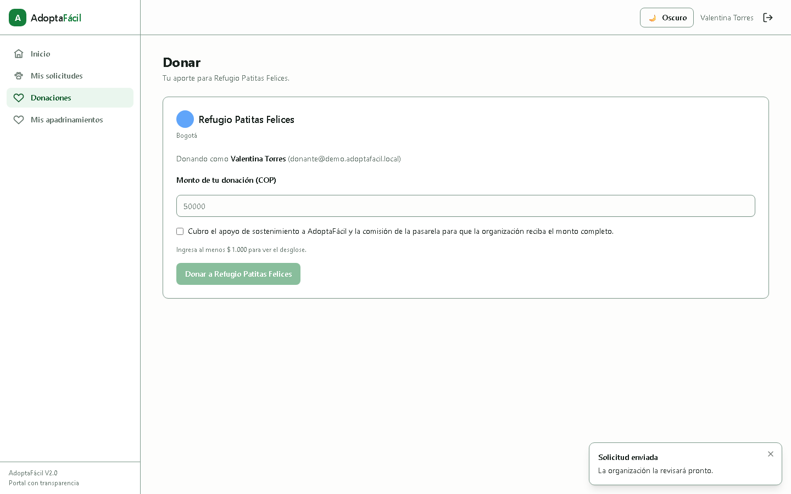
_Formulario de donación — monto a aportar._

Antes de pagar, AdoptaFácil siempre muestra el desglose completo: lo que pagas, el apoyo de sostenimiento a la plataforma (un pequeño porcentaje que permite que sea gratuita para las organizaciones), la comisión de la pasarela de pago (un costo real de un tercero, Wompi), y el neto que efectivamente recibe la organización. Nada queda oculto.

Puedes marcar la casilla para cubrir tú ambos costos (el apoyo a la plataforma y la comisión de la pasarela) — así la organización recibe el 100% de tu aporte:

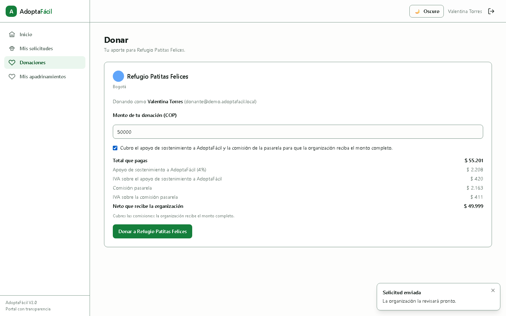
_Desglose transparente de la donación, con la casilla de cobertura marcada._

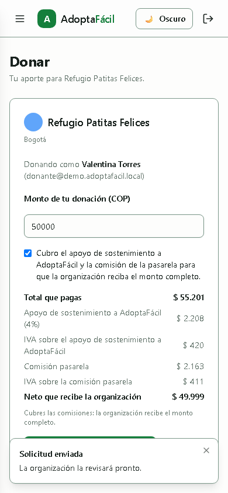
_El mismo desglose en un celular._

Al confirmar, la donación queda registrada de inmediato:

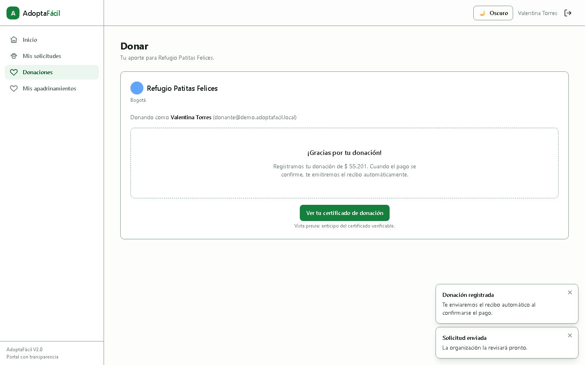
_Confirmación de la donación, con acceso directo al certificado._

### El certificado de donación

Cada donación (una vez que el pago se confirma) genera un certificado con los datos reales de la organización, tu nombre y el monto aportado, con un código único y un QR.

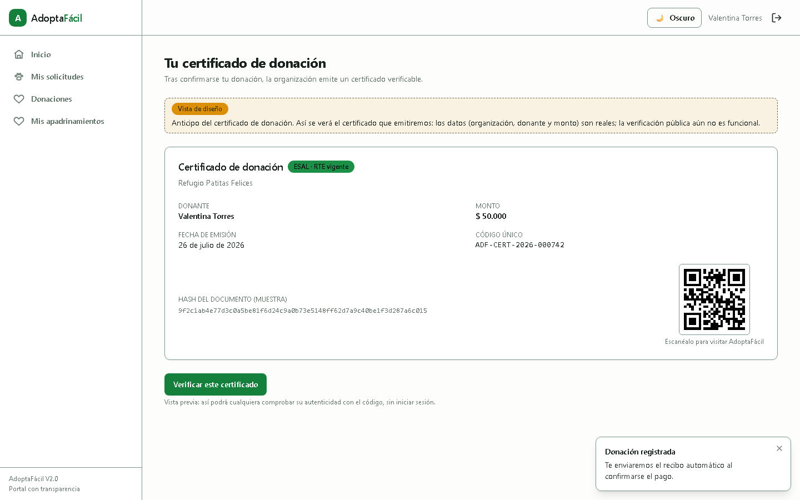
_Certificado de donación con datos reales y código QR._

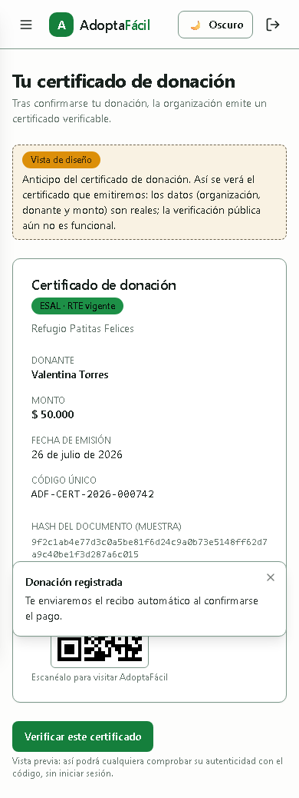
_El mismo certificado en un celular._

_Nota: El banner "Vista de diseño" es intencional: el certificado ya muestra datos reales, pero la verificación pública del código (que cualquiera pueda comprobar su autenticidad escaneando el QR o el código) todavía no está construida — es una fase posterior del proyecto. Este manual no promete una función que aún no existe._

### Mis donaciones

Todo tu historial de donaciones — a cualquier organización — vive en "Mis donaciones":

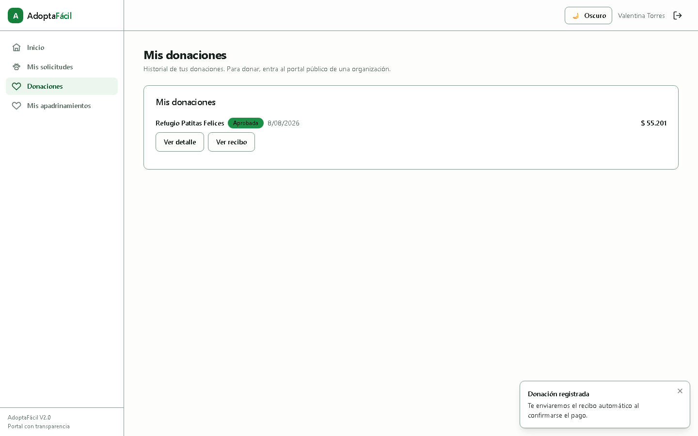
_Mis donaciones — historial del donante._

Desde ahí, "Ver detalle" abre el desglose completo de esa donación y, si ya fue aprobada, un acceso directo para volver a ver o descargar su certificado:

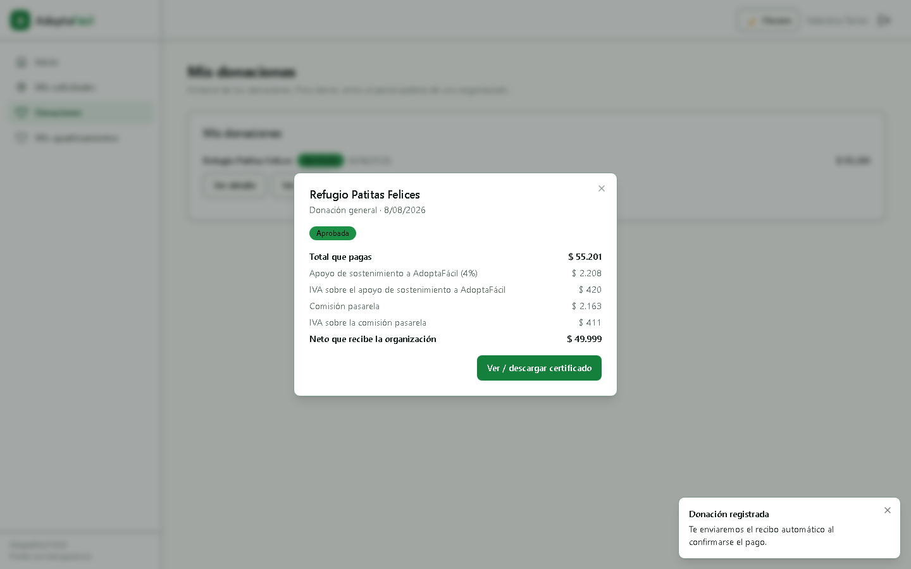
_Detalle de una donación, con acceso al certificado._

## 5. Apadrinamientos

Apadrinar un animal es distinto a adoptarlo: en vez de llevártelo a vivir contigo, te comprometes a un aporte mensual recurrente para su cuidado, mientras sigue bajo el cuidado de la organización. Puedes apadrinar cualquier animal disponible, lo hayas adoptado o no — el botón "Apadrinar" está disponible en el detalle de cualquier animal (sección 3).

Al pulsarlo, ves el plan de apadrinamiento disponible para ese animal en particular, con su aporte mensual:

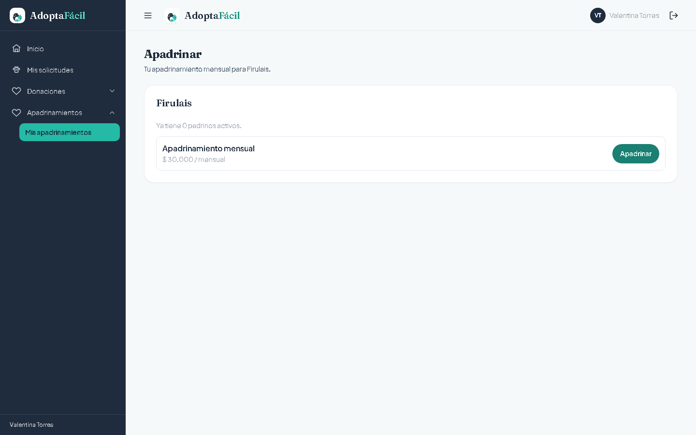
_Plan de apadrinamiento mensual para un animal, con el monto del aporte y el botón "Apadrinar"._

Al confirmar, ves una pantalla de agradecimiento. En este entorno de demostración el pago está simulado (no se procesa un cobro real), tal como se explica en pantalla:

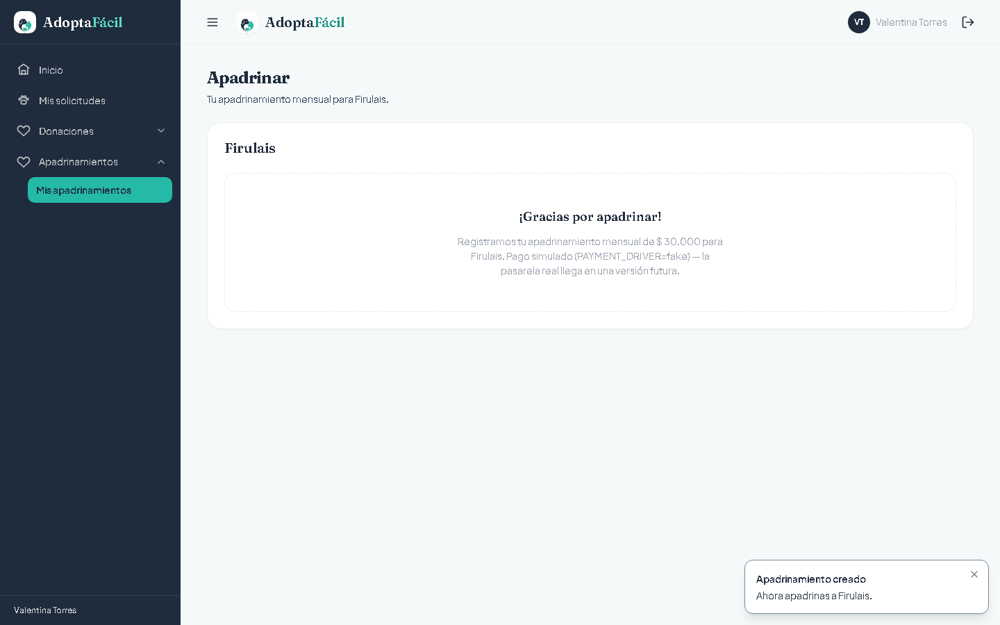
_"¡Gracias por apadrinar!" — confirmación con aviso de pago simulado._

Todo tu historial de apadrinamientos — a cualquier animal, de cualquier organización — vive en "Mis apadrinamientos": qué animal apadrinas, el estado del apadrinamiento, la organización dueña del animal, el monto mensual y desde cuándo lo sostienes.

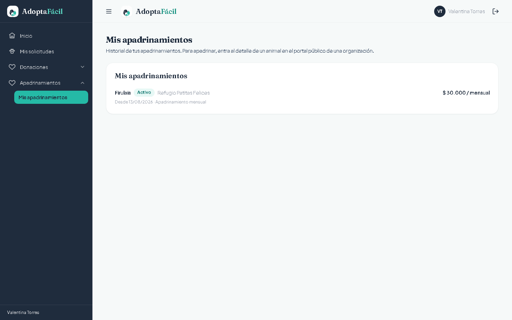
_Mis apadrinamientos — historial del padrino: animal, estado, organización y aporte mensual._

_Nota: si el animal que apadrinas fallece, la organización puede registrar ese hecho desde su propio panel ("Registrar fallecimiento", ver sección "6. Panel de la organización"). Hoy esa acción solo deja constancia del fallecimiento; lo que ocurre después con tu apadrinamiento — si se te reembolsa, si se te ofrece redirigirlo a otro animal, si recibes una notificación automática — es una parte del flujo que todavía no está terminada de construir. Este manual no promete un resultado automático que aún no existe._

## 6. Panel de la organización

Una cuenta de organización (Owner, Administrador u Operador) ve un menú distinto, con las herramientas de gestión que una Persona no tiene: evaluar adopciones, ver donaciones recibidas, gestionar animales, campañas, apadrinamientos y personalizar el portal.

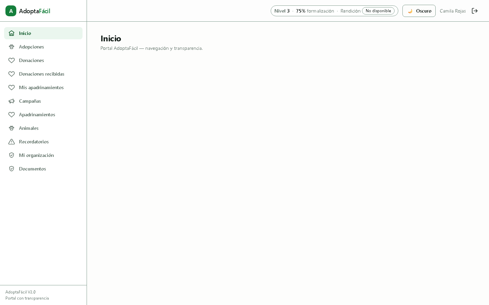
_Menú de una cuenta de organización._

### Mi organización (perfil)

No hay un botón de menú llamado "Mi organización": se llega a esta pantalla haciendo clic sobre el nombre de la organización, en la parte superior del menú lateral. Ahí se administra el perfil institucional: nombre, la dirección de tu propio portal público (el "slug", la parte final de la URL `/o/tu-organizacion`), NIT, razón social y una descripción corta. La pantalla también muestra qué tan completo está el perfil (como un porcentaje) y si ya está publicado en tu portal público.

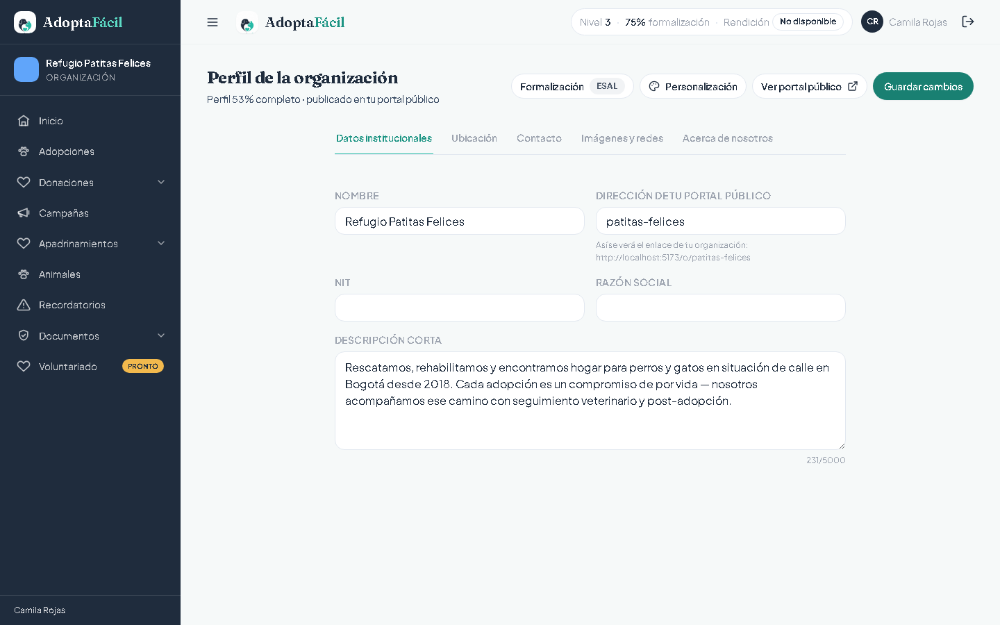
_Perfil de la organización — pestaña "Datos institucionales": nombre, slug, NIT, razón social y descripción; indicador de porcentaje completado._

Además de "Datos institucionales", el perfil tiene otras pestañas: Ubicación, Contacto, Imágenes y redes, y Acerca de nosotros — cada una guarda una parte distinta de la información pública de tu organización. Desde el encabezado de esta misma pantalla se accede también a Formalización, Personalización y a "Ver portal público" (para revisar cómo se ve tu organización desde afuera).

### Formalización

La formalización es el proceso por el cual una organización va demostrando, con documentos, que es una entidad real y confiable. Avanza en etapas, en este orden: **Informal → En proceso → Formalizada → ESAL → ESAL + RTE**. Cada etapa que se supera sube el "nivel de verificación" que se muestra en la parte superior de la pantalla, junto a la etiqueta "Nivel N" — una señal pública de confianza para quien visita tu portal.

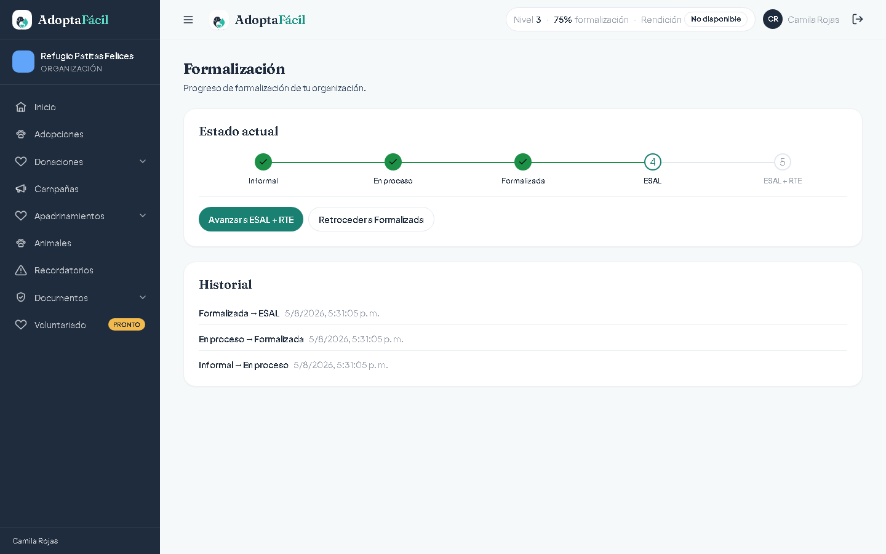
_Línea de tiempo de formalización — esta organización se encuentra en la etapa "ESAL"; debajo, el historial de etapas superadas._

Avanzar (o retroceder) de etapa requiere tener los documentos correspondientes aprobados, y solo puede hacerlo el Owner de la organización — retroceder, además, pide explicar el motivo.

### Documentos institucionales

Los documentos que respaldan la formalización se administran aquí: Certificado de existencia y representación legal, RUT, Documento del representante legal, y espacio para "Otro documento". Cada uno tiene su propio estado — Pendiente, En revisión, Aprobado, Rechazado, Observado, o Vencido si se pasó la fecha de vigencia.

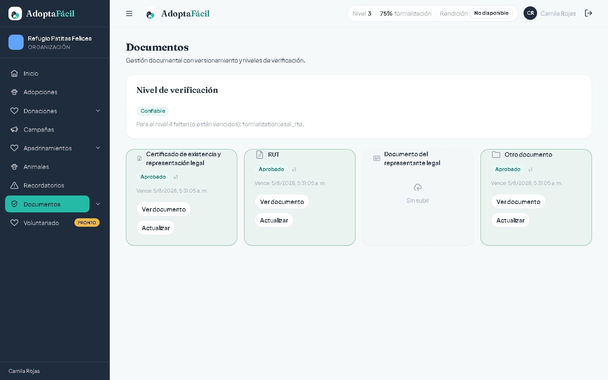
_Documentos de la organización, todos en estado "Aprobado"._

En una organización con documentos en trámite se ve distinto: aquí, un "Otro documento" que sigue en estado "Pendiente" mientras el resto ya fue aprobado.

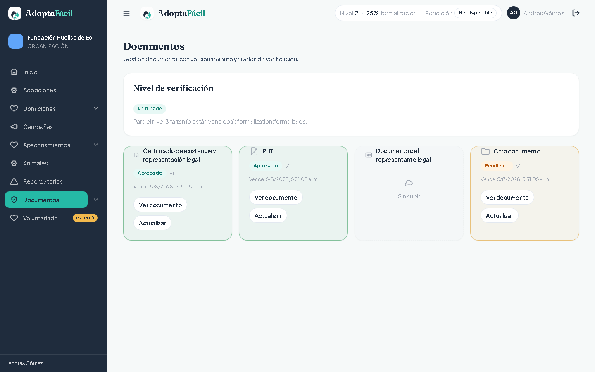
_Otra organización, en etapa "En proceso" de formalización: uno de sus documentos aún está "Pendiente" de revisión._

_Nota: quien revisa y decide sobre estos documentos es el equipo de AdoptaFácil (un rol de plataforma, no una cuenta de organización). Ese flujo de revisión no se documenta en detalle aquí porque este manual está escrito para cuentas Persona y Organización, no para el personal de la plataforma._

### Gestión de animales

Aquí una organización registra y administra a sus animales. A la izquierda hay un listado con buscador, filtro por especie y los botones "Importar Excel" (para dar de alta varios animales a la vez) y "Registrar animal"; cada fila muestra su estado (por ejemplo, "En adopción"). Al seleccionar un animal, a la derecha se abre su ficha: foto, nombre, raza, sexo y edad, con accesos directos para Editar, ver su Expediente médico, Eliminarlo o gestionar su Apadrinamiento.

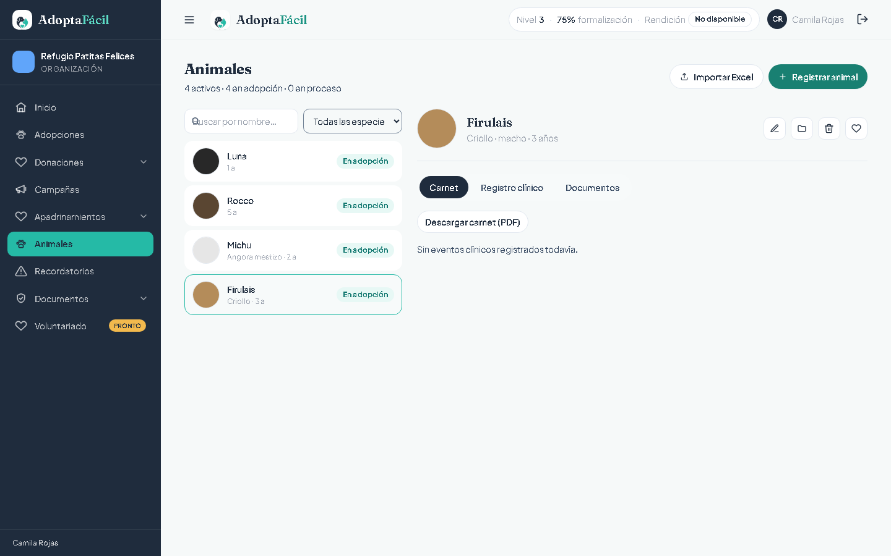
_Animales — listado a la izquierda, ficha del animal seleccionado a la derecha._

La ficha de cada animal tiene tres pestañas: **Carnet** (una cartilla de vacunación/identificación, descargable en PDF), **Registro clínico** (el historial de eventos clínicos — consultas, vacunas, procedimientos — donde una cuenta con rol Veterinario puede agregar un nuevo evento con su tipo, fecha, próxima fecha y un archivo adjunto) y **Documentos**.

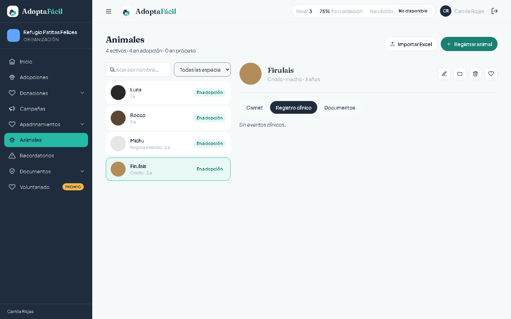
_Pestaña "Registro clínico" de un animal sin eventos registrados todavía, con el área para que un veterinario registre uno nuevo._

_Nota: la pestaña "Documentos" dentro de la ficha del animal todavía es solo un aviso de "Disponible próximamente" — no guarda archivos reales todavía._

### Recordatorios

La bandeja de recordatorios reúne avisos pendientes para la organización (por ejemplo, vencimientos o seguimientos). Hoy, en una organización recién creada, aparece vacía:

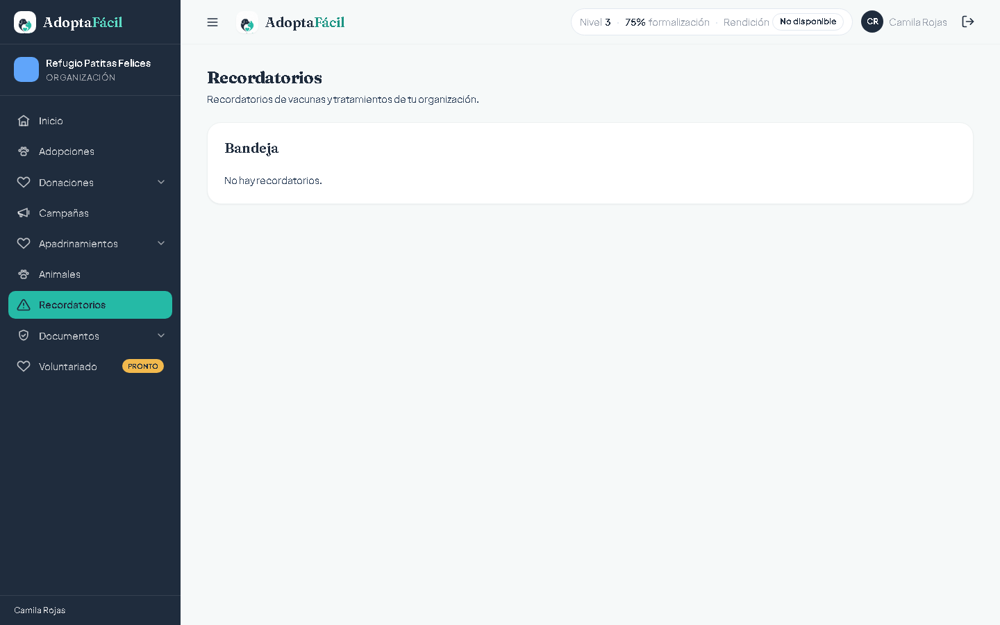
_Bandeja de recordatorios — estado vacío: "No hay recordatorios."_

### Tablero de adopciones

Las solicitudes que llegan a la organización se organizan en un tablero con cuatro columnas: Nuevas, En evaluación, Aprobada y Rechazada.

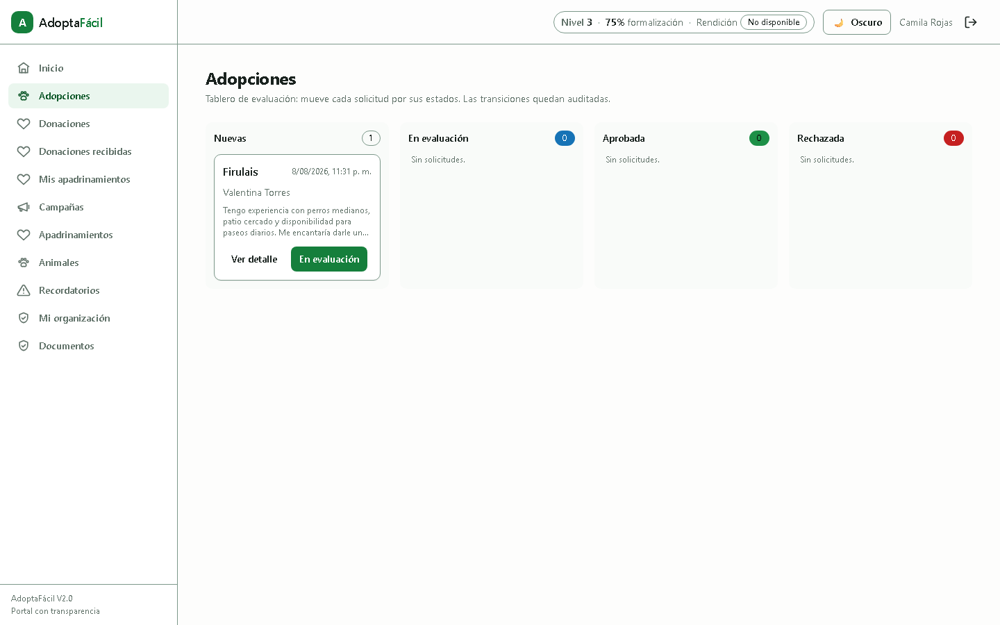
_Tablero de evaluación de solicitudes de adopción._

"Ver detalle" abre la ficha completa del solicitante antes de decidir:

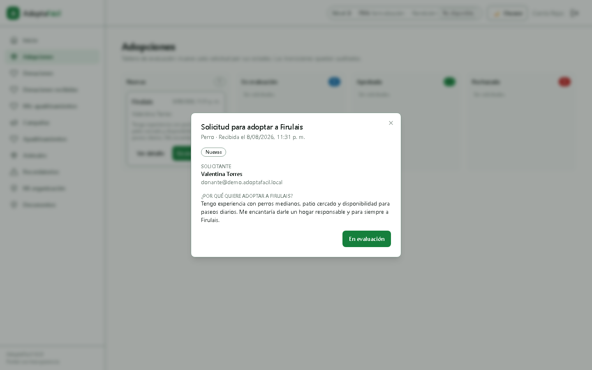
_Detalle del solicitante, con el botón para avanzar su solicitud._

### Donaciones recibidas

La contraparte de "Mis donaciones" del lado de la organización: todo lo que ha recibido, con el nombre del donante (una vez que el recibo se emite) y el monto neto.

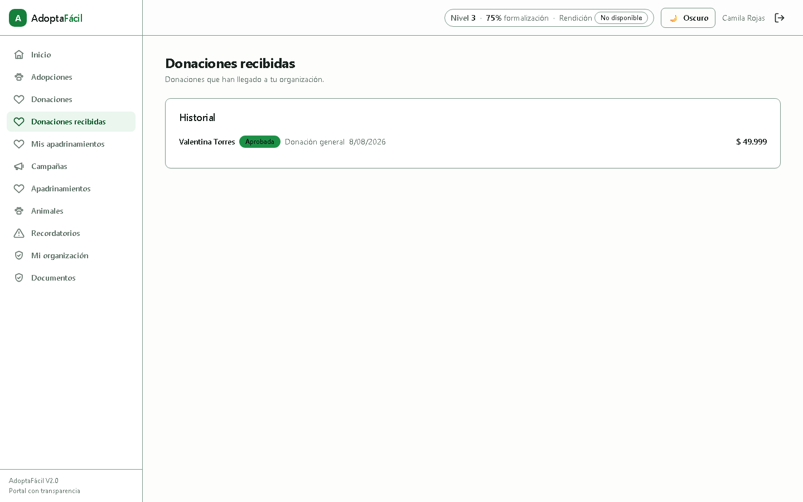
_Donaciones recibidas por la organización._

### Apadrinamientos recibidos

La contraparte de "Mis apadrinamientos" del lado de la organización: aquí se administran todos los apadrinamientos activos sobre los animales de la organización. Arriba hay tarjetas de resumen (padrinos activos, ingreso mensual total, animales apadrinados, pagos fallidos) y abajo una tabla con cada padrino, el animal que apadrina, su aporte mensual, el estado del apadrinamiento y acciones disponibles: Suspender, Registrar fallecimiento y Cancelar.

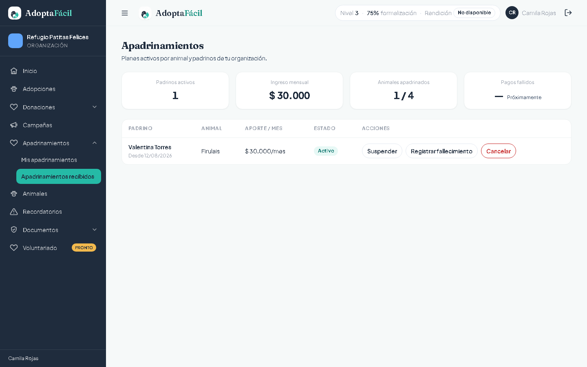
_Apadrinamientos recibidos — tarjetas de resumen y tabla de padrinos con sus acciones._

_Nota: como se explica en la sección anterior, "Registrar fallecimiento" hoy deja constancia del hecho, pero no dispara todavía las acciones posteriores (reembolso, reasignación o notificación al padrino) — esa parte del flujo sigue en construcción._

### Personalización del portal

Desde "Mi organización" → "Personalización", la organización elige los colores de su portal público — su propia identidad visual, sin tocar código. El radio de las esquinas de los componentes ahora se elige desde una lista desplegable (por ejemplo, "Mediano") en vez de escribirlo a mano, y ya no aparece ningún aviso de contraste que bloquee el guardado — se puede guardar la personalización sin fricciones.

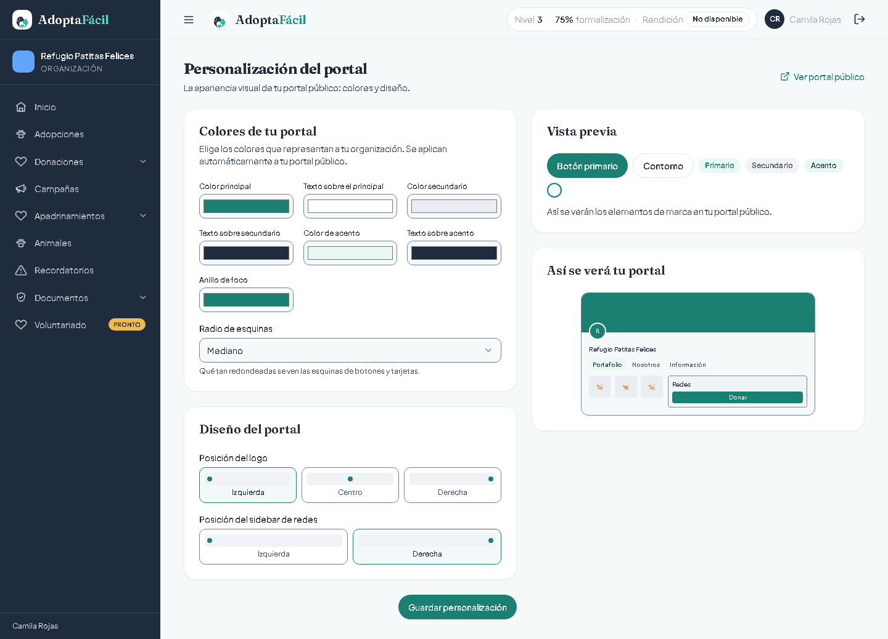
_Pantalla de personalización de colores del portal público, con el radio de esquinas como lista desplegable._

### Gestión de campañas

Esta es una pantalla distinta al portafolio público de campañas (que se explica más abajo): aquí, desde su propio panel, una organización crea y edita sus campañas de recaudación. En una organización nueva, la lista aparece vacía:

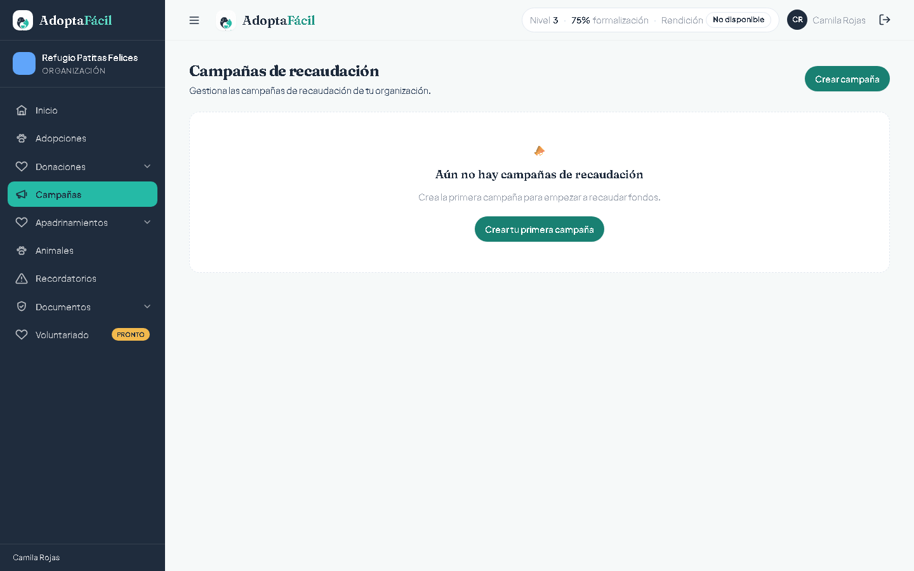
_Gestión de campañas de la organización — estado vacío: "Aún no hay campañas de recaudación."_

Al crear una campaña nueva se pide título, descripción, categoría, meta de recaudación (en pesos colombianos) y fecha límite. Una vez creada, la organización también puede adjuntarle "evidencias de rendición" — comprobantes de en qué se usó el dinero recaudado (tipo, monto opcional, concepto, fecha del gasto y un archivo).

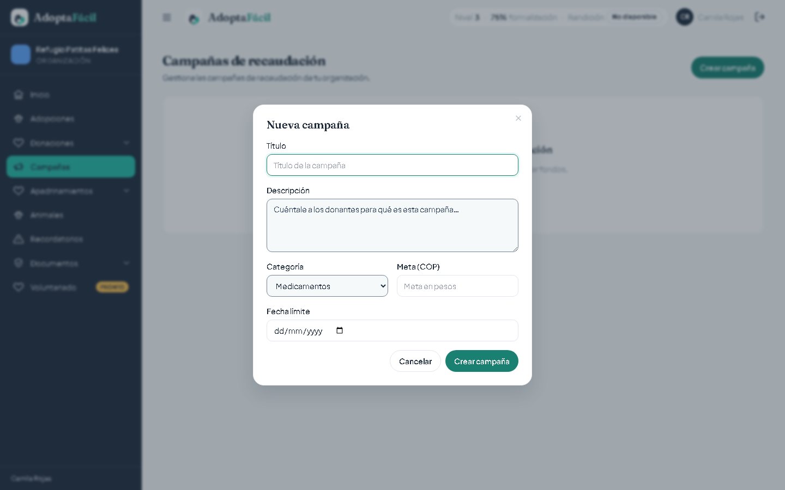
_Formulario de creación de una nueva campaña: título, descripción, categoría, meta y fecha límite._

### Campañas en el portafolio público

Las campañas de recaudación activas de cualquier organización aparecen en un portafolio público general, con su meta y su avance:

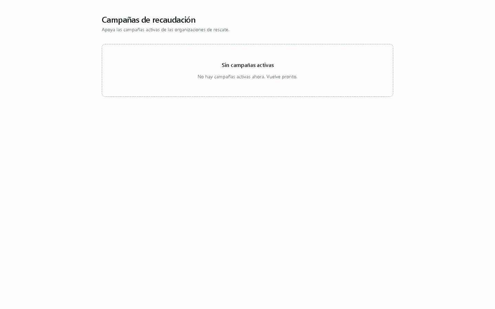
_Portafolio público de campañas de recaudación activas._

_Nota: Esta vista pública general ya existe y funciona. Mostrar las campañas de UNA organización específica dentro de su propio portal (`/o/:slug`) todavía no es posible: el backend aún no expone un endpoint público filtrado por organización para esto — está identificado como pendiente y no se documenta aquí como si ya funcionara._

### Módulos próximamente

Algunas opciones del menú ya son visibles, pero todavía no tienen una función real detrás: al entrar, muestran un aviso de "Disponible próximamente" con una etiqueta "PRONTO". Hoy esto aplica a **Voluntariado**, y dentro de "Documentos" a **Transparencia nacional** y **Reporte exógeno**.

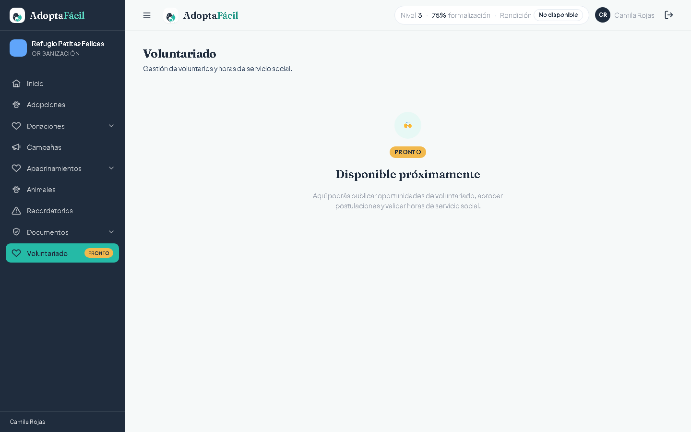
_Aviso "Disponible próximamente" con etiqueta "PRONTO" — así se ven hoy Voluntariado, Transparencia nacional y Reporte exógeno._

## 7. Acceso y seguridad

AdoptaFácil sigue un principio simple: cada persona ve solo lo que le corresponde. Si una cuenta intenta entrar a una sección para la que no tiene permiso — por ejemplo, escribiendo la dirección directamente —, no ve un error técnico ni una pantalla en blanco: ve un aviso claro.

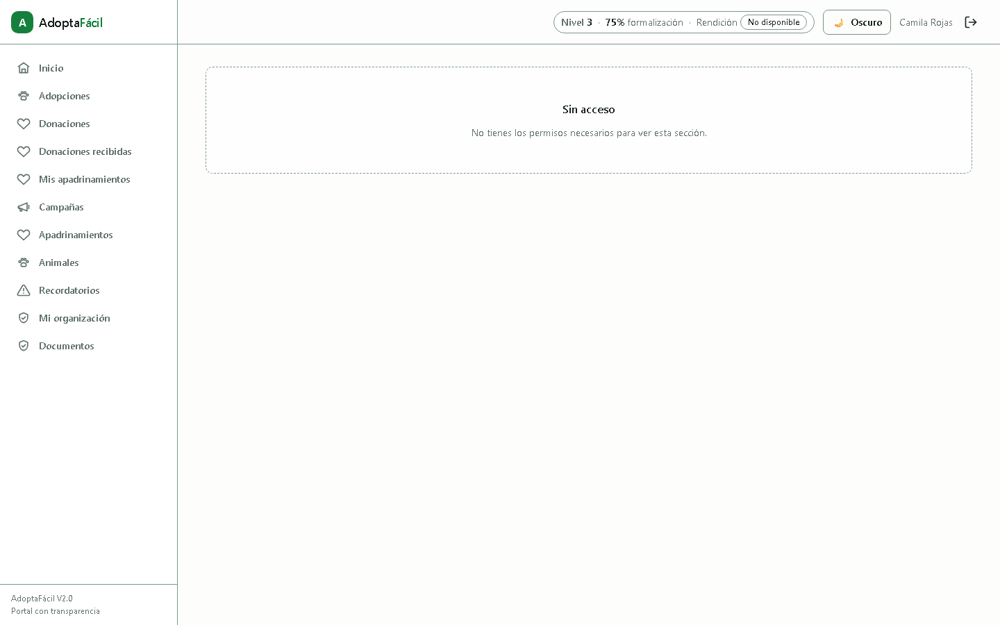
_Aviso de "Sin acceso" al intentar entrar a una sección no permitida._

Esto aplica en ambas direcciones: una Persona nunca ve las herramientas de gestión de una organización, y una organización nunca ve las de otra organización distinta ni las de la administración de la plataforma.

## 8. Preguntas frecuentes

**¿AdoptaFácil cobra algo a las organizaciones por estar en la plataforma?**
No. Registrarse y publicar animales es gratuito. La plataforma se sostiene con un pequeño porcentaje de apoyo de sostenimiento sobre las donaciones que la propia organización recibe — nunca sobre las adopciones.

**¿Por qué veo un cargo por "comisión de la pasarela" además del apoyo a AdoptaFácil?**
Son dos cosas distintas. El apoyo de sostenimiento es lo que AdoptaFácil retiene para operar. La comisión de la pasarela es un costo real cobrado por el proveedor de pagos (Wompi), un tercero — no algo que AdoptaFácil se quede.

**¿Puedo verificar públicamente que un certificado de donación es auténtico?**
Todavía no. El certificado ya muestra datos reales de tu donación, pero la verificación pública del código (para que cualquiera la compruebe sin iniciar sesión) es una función planeada para una fase posterior.

**¿Qué pasa si intento entrar a una sección que no me corresponde?**
Ves un aviso de "Sin acceso" — nunca un error confuso ni, mucho menos, los datos de otra cuenta u organización.

**¿Puedo apadrinar un animal sin adoptarlo?**
Sí. El botón "Apadrinar" en el detalle de cualquier animal inicia un aporte mensual recurrente, independiente de una adopción.

**¿Qué pasa si el animal que apadrino fallece?**
La organización puede registrar el fallecimiento desde su panel de "Apadrinamientos recibidos". Hoy esa acción solo deja constancia del hecho; qué pasa después con tu apadrinamiento (reembolso, redirección a otro animal, notificación) es una parte del flujo que todavía está en construcción — este manual no promete algo que aún no existe.

**¿Qué es el "Nivel" y el "% de formalización" que veo arriba?**
Son dos señales de confianza relacionadas. El "% completo" en el perfil de tu organización mide qué tan lleno está tu perfil institucional (datos, ubicación, contacto, imágenes, etc.). El "Nivel N" refleja en qué etapa de formalización estás (Informal, En proceso, Formalizada, ESAL o ESAL + RTE), lo cual depende de tener aprobados los documentos que esa etapa exige. Ambos son visibles para quien visita tu portal público, como una manera transparente de mostrar qué tan verificada está tu organización.
