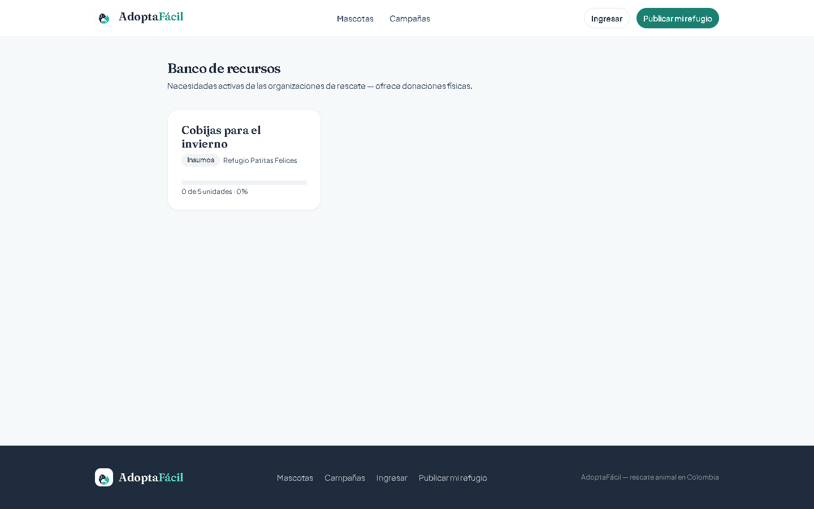
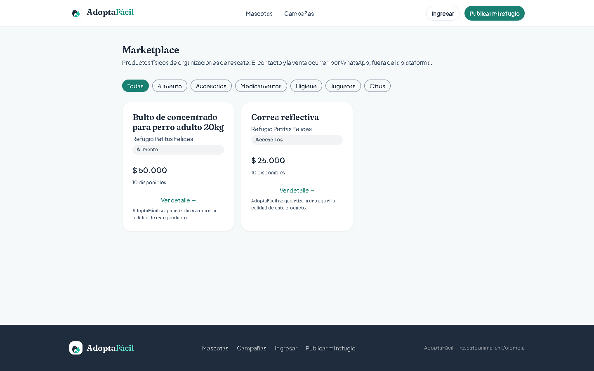
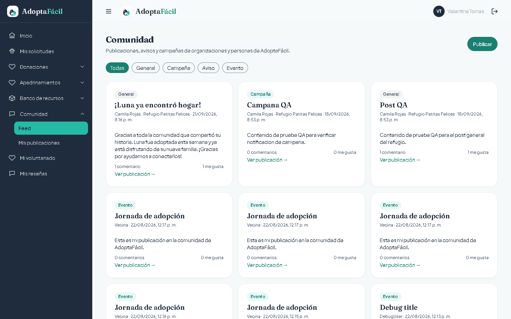
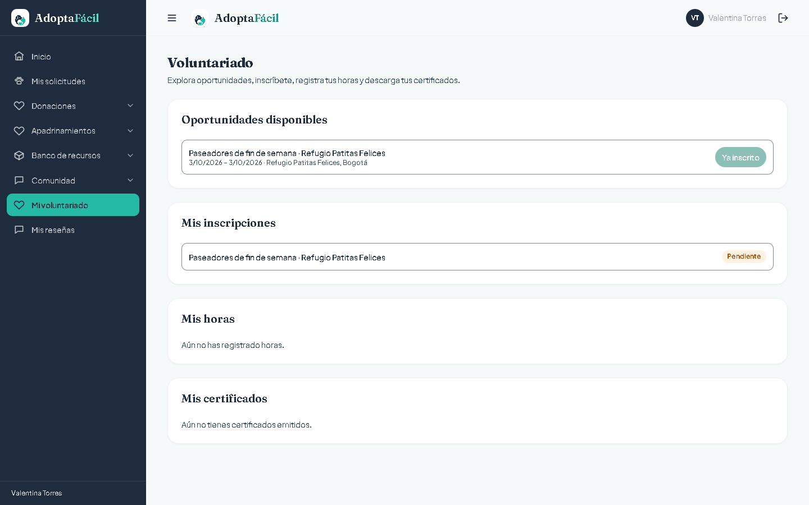
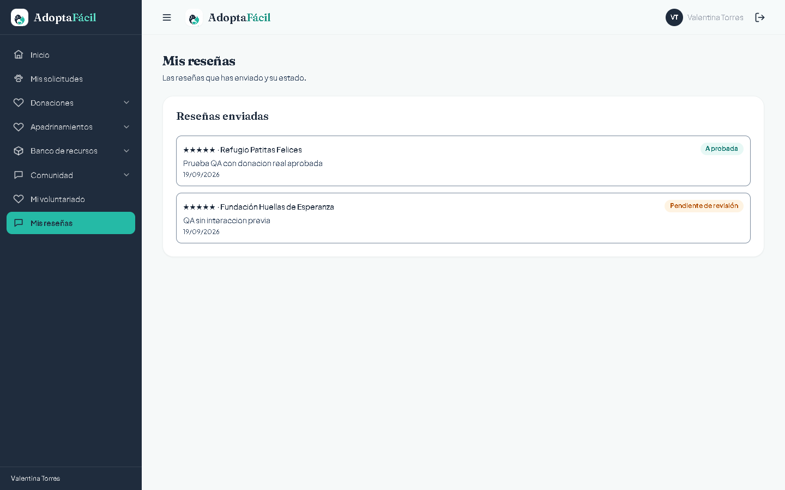

# AdoptaFácil

## Manual de Usuario — Personas (adoptantes, donantes, padrinos, voluntarios)

_Conéctalos. Cambia sus vidas._

Este manual es para ti si usas AdoptaFácil como **persona**: quieres adoptar, donar, apadrinar, ofrecer
ayuda, comprar en el marketplace de una organización, ser voluntario o simplemente participar en la
comunidad. Si en cambio representas a una organización de rescate, consulta el
_Manual de Usuario — Organizaciones_.

Las capturas de este manual provienen de sesiones reales de la aplicación, con datos de demostración.

## Índice

[TOC]

## 1. Qué puedes hacer en AdoptaFácil

AdoptaFácil conecta a las organizaciones de rescate animal (refugios, fundaciones) con las personas que
quieren ayudarlas. Como Persona puedes:

- **Adoptar** un animal en estado disponible de cualquier organización de la plataforma.
- **Donar** dinero a una organización, con desglose transparente de comisiones antes de pagar.
- **Apadrinar** un animal con un aporte mensual, sin adoptarlo.
- **Ofrecer** una donación física (comida, insumos, medicamentos) a través del Banco de recursos.
- **Comprar o contactar** productos del Marketplace de una organización.
- **Ser voluntario**: inscribirte a oportunidades, registrar tus horas y obtener tu certificado.
- **Participar en la Comunidad**: publicar, comentar y reaccionar a publicaciones de cualquier
  organización.
- **Calificar** a una organización con la que hayas tenido contacto.

Cada cuenta ve solo lo que le corresponde: nunca verás el panel de gestión de una organización, y
ninguna organización ve tus datos privados de otras organizaciones.

## 2. Primeros pasos

Al entrar a AdoptaFácil sin haber iniciado sesión, ves una página de bienvenida con el mensaje
"Encuentra a tu próxima mascota" y dos botones — "Ver mascotas en adopción" y "Soy una organización" —
además de un resumen de la plataforma.

_Página de bienvenida pública._

Al pulsar "Ver mascotas en adopción" llegas al catálogo general, con filtros por especie, buscador por
nombre y ciudades con conteo de animales.

_Catálogo público — filtros a la izquierda, tarjetas de animales a la derecha._

_El catálogo también puede navegarse sin usar los filtros._

Para adoptar, donar, apadrinar, ofrecer un recurso, participar en la comunidad o ser voluntario
necesitas una cuenta. El registro es rápido:

_Registro de una cuenta nueva._

_Inicio de sesión con correo y contraseña._

Una vez dentro, ves tu propio menú lateral. Nota que las secciones de gestión de una organización
(Adopciones a evaluar, Donaciones recibidas, etc.) no aparecen — son exclusivas de cuentas de
organización.

_Menú de una cuenta Persona._

## 3. Explorar y adoptar

Desde el catálogo (o el portal de una organización) abres el detalle de cualquier animal disponible:
especie, sexo, tamaño y edad calculada automáticamente.

_Detalle público, con los botones "Solicitar adopción" y "Apadrinar"._

_La misma pantalla en un celular._

Si no has iniciado sesión, "Solicitar adopción" te pide hacerlo primero. Ya autenticado, llegas al
formulario, que pide tu nombre, correo, teléfono (opcional) y un mensaje de **mínimo 50 caracteres**
explicando por qué quieres adoptar — un mensaje más corto se rechaza antes de enviarse.

Al enviarla, queda registrada de inmediato en estado "Nuevas":

Sigue el estado de todas tus solicitudes desde "Mis solicitudes" — la organización la moverá por las
etapas Nuevas → En evaluación → Aprobada o Rechazada.

_Nota: solo puedes tener una solicitud activa por animal a la vez; si ya tienes una en curso, una
segunda solicitud al mismo animal se rechaza. Tampoco puedes postular a un animal de una organización de
la que ya seas miembro (conflicto de interés)._

Si abres el detalle de un animal desde el catálogo general en vez del portal propio de la organización,
se abre como ventana superpuesta sobre el catálogo, con un acceso adicional a "Acceder a la organización".

Una vez aprobada tu adopción, la organización puede generarte un **contrato de adopción con firma
electrónica** y darte seguimiento post-adopción (hitos, evidencias, alertas si algo queda vencido) desde
tu propia cuenta — revisa el detalle de tu solicitud aprobada para verlo.

## 4. Donaciones

Cada organización tiene un portal público propio, con su información, sus animales en adopción y un
botón para donarle directamente.

Al pulsar "Donar", ves el formulario de aporte:

Antes de pagar, AdoptaFácil siempre muestra el desglose completo: lo que pagas, el apoyo de
sostenimiento a la plataforma (4% + IVA sobre ese 4%, nunca sobre el total), la comisión de la pasarela
de pago (Wompi, un costo real de un tercero) y el neto que efectivamente recibe la organización. Puedes
marcar la casilla para cubrir tú ambos costos, de modo que la organización reciba el 100% de tu aporte.

Al confirmar, la donación queda registrada de inmediato:

### El certificado de donación

Cada donación aprobada genera un certificado real con los datos de la organización, tu nombre, el monto
y un código único con QR.

El código QR lleva a una página pública de verificación: cualquiera puede confirmar la autenticidad del
certificado escaneándolo, sin necesidad de iniciar sesión. El certificado solo se emite para donaciones a
organizaciones formalizadas como ESAL con RTE vigente; si la organización aún no llegó a esa etapa, no
verás el certificado disponible todavía.

### Mis donaciones

Todo tu historial — a cualquier organización — vive en "Mis donaciones":

"Ver detalle" abre el desglose completo y, si ya fue aprobada, el acceso a su certificado.

## 5. Apadrinamientos

Apadrinar es distinto a adoptar: te comprometes a un aporte mensual recurrente para el cuidado del
animal, mientras sigue bajo el cuidado de la organización. El botón "Apadrinar" está en el detalle de
cualquier animal.

_En este entorno de demostración el pago está simulado._

Tu historial completo vive en "Mis apadrinamientos": animal, estado, organización, aporte mensual y
desde cuándo lo sostienes.

Si un cobro mensual falla (por ejemplo, tu tarjeta fue rechazada), el sistema reintenta automáticamente
durante varios días y te avisa en cada intento; si se agotan los reintentos, tu apadrinamiento pasa a
"Suspendido" y se te notifica.

_Nota: si el animal que apadrinas fallece, la organización puede registrar el fallecimiento desde su
panel. Al hacerlo, tu apadrinamiento pasa automáticamente a "Suspendido" y recibes una notificación
avisándote del fallecimiento y de que la organización se pondrá en contacto contigo. Reasignarte a otro
animal, devolverte el mes en curso, o un mensaje personalizado del padrino todavía no están construidos
— este manual no promete más de lo que la plataforma hace hoy._

## 6. Banco de recursos

Además de dinero, puedes ofrecer ayuda en especie: comida, insumos, medicamentos u otros elementos que
una organización esté necesitando.

Desde "Banco de recursos" ves las necesidades publicadas por las organizaciones y puedes ofrecer una
donación física contra una de ellas. Tu historial de ofertas vive en "Mis ofertas". La organización
coordina contigo la entrega y, una vez recibida, deja evidencia de que se cumplió.

_Necesidades activas publicadas por las organizaciones._

## 7. Marketplace

Cada organización puede tener su propio catálogo de productos (por ejemplo, artículos de merchandising o
insumos que vende para financiarse). En cada producto verás siempre visible un aviso de que
**AdoptaFácil no garantiza la entrega ni la calidad del producto** — la compra se coordina directamente
con la organización. No hay carrito ni pago en línea: el botón de cada producto te lleva a WhatsApp para
contactar directamente a la organización vendedora.

_Catálogo público de productos, con el aviso de no garantía siempre visible._

## 8. Comunidad

En "Comunidad" → "Feed" ves publicaciones de todas las organizaciones de la plataforma: novedades
generales, campañas, avisos y eventos. Puedes comentar y dar like a cualquier publicación, y en "Mis
publicaciones" ves lo que tú mismo has publicado. Solo puedes editar o borrar tus propias publicaciones;
la moderación de contenido inapropiado la hace el equipo de AdoptaFácil, no las organizaciones.

_Feed cruzado de publicaciones de todas las organizaciones y personas._

## 9. Voluntariado

En "Mi voluntariado" ves las oportunidades publicadas por las organizaciones, te inscribes y registras
tus horas de servicio a medida que las cumples; la organización las revisa y aprueba. Si eres estudiante
de grado 10° u 11° cursando tu servicio social, al alcanzar las 80 horas exigidas por la normatividad
puedes descargar tu certificado directamente desde la plataforma.

_Oportunidades disponibles, tus inscripciones, horas y certificados._

## 10. Reseñas

Desde "Mis reseñas" puedes calificar (1 a 5) y dejar un comentario sobre una organización con la que
hayas tenido una adopción, donación o apadrinamiento reales — la plataforma verifica esto antes de dejarte
publicar la reseña, no es solo una sugerencia. Solo puedes dejar una reseña por organización; queda
pendiente de revisión antes de aparecer en el indicador público de esa organización.

_Tus reseñas enviadas y su estado (pendiente de revisión o aprobada)._

## 11. Acceso y seguridad

AdoptaFácil sigue un principio simple: cada persona ve solo lo que le corresponde. Si intentas entrar a
una sección para la que no tienes permiso, no ves un error técnico ni una pantalla en blanco: ves un
aviso claro.

## 12. Preguntas frecuentes

**¿AdoptaFácil cobra algo a las organizaciones por estar en la plataforma?**
No. Registrarse y publicar animales es gratuito. La plataforma se sostiene con un pequeño porcentaje de
apoyo sobre las donaciones que la propia organización recibe — nunca sobre las adopciones.

**¿Por qué veo un cargo por "comisión de la pasarela" además del apoyo a AdoptaFácil?**
Son dos cosas distintas. El apoyo de sostenimiento es lo que AdoptaFácil retiene para operar. La
comisión de la pasarela es un costo real cobrado por el proveedor de pagos (Wompi), un tercero.

**¿Puedo verificar públicamente que un certificado de donación es auténtico?**
Sí. El código QR del certificado lleva a una página pública de verificación que confirma su autenticidad
sin necesidad de iniciar sesión.

**¿Qué pasa si intento entrar a una sección que no me corresponde?**
Ves un aviso de "Sin acceso" — nunca un error confuso ni, mucho menos, los datos de otra cuenta u
organización.

**¿Puedo apadrinar un animal sin adoptarlo?**
Sí. El botón "Apadrinar" en el detalle de cualquier animal inicia un aporte mensual recurrente,
independiente de una adopción.

**¿Qué pasa si el animal que apadrino fallece?**
La organización registra el fallecimiento desde su panel; tu apadrinamiento pasa automáticamente a
"Suspendido" y recibes una notificación. Reasignarte a otro animal, devolverte el mes en curso, o un
mensaje personalizado del padrino todavía no están construidos — para eso, contacta directamente a la
organización.

**¿Qué es el "Nivel" y el "% de formalización" que veo en el portal de una organización?**
Dos señales de confianza relacionadas. El "% completo" mide qué tan lleno está el perfil institucional
de la organización. El "Nivel N" refleja su etapa de formalización (Informal, En proceso, Formalizada,
ESAL o ESAL + RTE), la cual depende de tener aprobados los documentos que esa etapa exige.

**¿Puedo comprar en el Marketplace directamente desde la plataforma?**
No con pago en línea. El contacto es por WhatsApp directo con la organización, y AdoptaFácil deja claro
en cada producto que no garantiza la entrega ni la calidad — la transacción es entre tú y la
organización.
